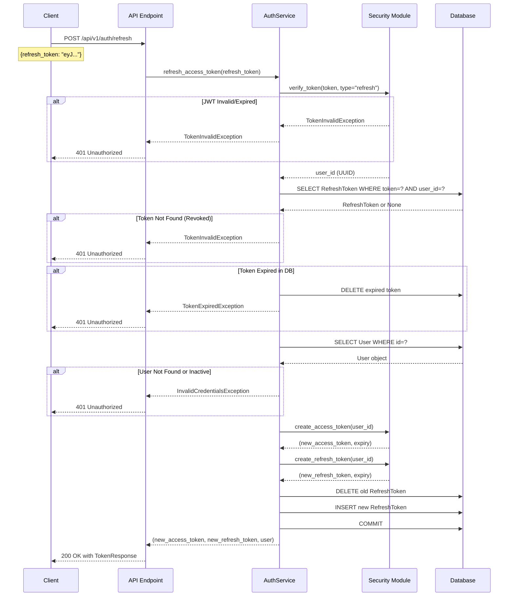

# Backend Task 03.05: Token Refresh Endpoint - Technical Implementation Plan

**Created**: 2025-11-29
**Status**: ✅ COMPLETED (2025-11-29)
**Actual Duration**: 60 minutes
**Type**: Architecture Documentation & Implementation Plan
**Priority**: Critical

**Completion Summary**:
- Token rotation implemented (old token deleted, new token created)
- User validation added (is_active check, user existence check)
- Proper exception handling (TokenExpiredException, TokenInvalidException)
- 11 unit tests written and passing (100% coverage)
- Verification script created: scripts/verify_refresh.py
- QA Report: [../../qa/task-03.05-verification.md](../../qa/task-03.05-verification.md)
- Verdict: **READY FOR PRODUCTION**

---

## 1. Overview

### 1.1 Task Description
Implement a token refresh endpoint that allows clients to obtain new access and refresh tokens using a valid refresh token. This enables seamless user sessions without requiring re-authentication when the access token expires.

### 1.2 Objectives
- Verify and decode JWT refresh tokens
- Validate refresh tokens against database records
- Implement token rotation (delete old, create new)
- Handle expired and revoked token scenarios
- Maintain security while providing smooth UX

### 1.3 Dependencies
- ✅ Task 03.01: Password hashing (bcrypt, cost factor 12)
- ✅ Task 03.02: JWT token management (HS256 algorithm)
- ✅ Task 03.03: User registration endpoint
- ✅ Task 03.04: Login endpoint (generates initial tokens)
- ✅ Database models: User, RefreshToken
- ✅ Pydantic schemas: TokenRefresh, TokenResponse

---

## 2. Architecture & Data Flow

### 2.1 Token Refresh Flow



### 2.2 Component Architecture

```
┌─────────────────────────────────────────────────────────────────┐
│                         Token Refresh Flow                       │
├─────────────────────────────────────────────────────────────────┤
│                                                                  │
│  ┌─────────────┐    ┌──────────────┐    ┌─────────────────┐    │
│  │   Client    │───▶│  API Router  │───▶│   AuthService   │    │
│  │  (Frontend) │    │  (FastAPI)   │    │  (Business Logic)│    │
│  └─────────────┘    └──────────────┘    └─────────────────┘    │
│                             │                     │              │
│                             │                     ▼              │
│                             │            ┌─────────────────┐    │
│                             │            │ Security Module │    │
│                             │            │ - verify_token  │    │
│                             │            │ - create_*_token│    │
│                             │            └─────────────────┘    │
│                             │                     │              │
│                             ▼                     ▼              │
│                     ┌──────────────────────────────────┐        │
│                     │           PostgreSQL              │        │
│                     │  - users table                    │        │
│                     │  - refresh_tokens table           │        │
│                     └──────────────────────────────────┘        │
└─────────────────────────────────────────────────────────────────┘
```

### 2.3 Token Rotation Security Model

```
┌────────────────────────────────────────────────────────────────┐
│                    Token Rotation Process                       │
├────────────────────────────────────────────────────────────────┤
│                                                                 │
│  Before Refresh:                                                │
│  ┌─────────────────────┐    ┌─────────────────────────────┐   │
│  │ refresh_tokens      │    │ Client Storage               │   │
│  ├─────────────────────┤    ├─────────────────────────────┤   │
│  │ id: abc-123         │    │ access_token: eyJ...(old)   │   │
│  │ user_id: user-456   │◀──▶│ refresh_token: eyJ...(R1)   │   │
│  │ token: eyJ...(R1)   │    │                             │   │
│  │ expires_at: +30d    │    │                             │   │
│  └─────────────────────┘    └─────────────────────────────┘   │
│                                                                 │
│  After Refresh:                                                 │
│  ┌─────────────────────┐    ┌─────────────────────────────┐   │
│  │ refresh_tokens      │    │ Client Storage               │   │
│  ├─────────────────────┤    ├─────────────────────────────┤   │
│  │ id: def-789         │    │ access_token: eyJ...(new)   │   │
│  │ user_id: user-456   │◀──▶│ refresh_token: eyJ...(R2)   │   │
│  │ token: eyJ...(R2)   │    │                             │   │
│  │ expires_at: +30d    │    │                             │   │
│  └─────────────────────┘    └─────────────────────────────┘   │
│                                                                 │
│  OLD TOKEN (R1) IS DELETED - Cannot be reused!                 │
└────────────────────────────────────────────────────────────────┘
```

---

## 3. Implementation Details

### 3.1 Data Models

#### TokenRefresh Schema (Request)
```python
# File: src/schemas/user.py (existing or to verify)

class TokenRefresh(BaseModel):
    """Schema for token refresh request."""
    refresh_token: str = Field(
        ...,
        min_length=1,
        description="Valid refresh token from login or previous refresh"
    )

    model_config = ConfigDict(
        json_schema_extra={
            "example": {
                "refresh_token": "eyJhbGciOiJIUzI1NiIsInR5cCI6IkpXVCJ9..."
            }
        }
    )
```

#### TokenResponse Schema (Response)
```python
# File: src/schemas/user.py (existing)

class TokenResponse(BaseModel):
    """Schema for JWT token response."""
    access_token: str       # New 30-minute access token
    refresh_token: str      # New 30-day refresh token (rotated)
    token_type: str = "bearer"
    expires_in: int         # Seconds until access token expiry
```

### 3.2 Service Layer Implementation

```python
# File: src/services/auth_service.py

from datetime import datetime
from typing import Tuple
from uuid import UUID

from sqlalchemy import select
from sqlalchemy.ext.asyncio import AsyncSession
from sqlalchemy.orm import selectinload

from src.core.exceptions import (
    InvalidCredentialsException,
    TokenExpiredException,
    TokenInvalidException,
)
from src.core.security import (
    create_access_token,
    create_refresh_token,
    verify_token,
)
from src.db.models import RefreshToken, User
from src.schemas.user import TokenRefresh, TokenResponse


class AuthService:
    """Authentication service for user management."""

    def __init__(self, db: AsyncSession):
        self.db = db

    async def refresh_access_token(
        self,
        refresh_token_str: str
    ) -> Tuple[str, str, User]:
        """
        Refresh access token using a valid refresh token.

        Implements token rotation: old refresh token is deleted,
        new one is created. This prevents token reuse attacks.

        Args:
            refresh_token_str: JWT refresh token string

        Returns:
            Tuple of (new_access_token, new_refresh_token, user)

        Raises:
            TokenExpiredException: Refresh token has expired
            TokenInvalidException: Refresh token invalid or revoked
            InvalidCredentialsException: User not found or inactive

        Flow:
            1. Verify JWT signature and extract user_id
            2. Check token exists in database (not revoked)
            3. Verify token not expired in database
            4. Load user and verify is_active
            5. Generate new access and refresh tokens
            6. Delete old refresh token (rotation)
            7. Store new refresh token
            8. Return new tokens and user
        """
        # Step 1: Verify JWT signature and extract user_id
        try:
            user_id = verify_token(refresh_token_str, token_type="refresh")
        except TokenExpiredException:
            # Clean up expired token from database if it exists
            await self._cleanup_token(refresh_token_str)
            raise
        except TokenInvalidException:
            raise

        # Step 2: Check token exists in database (not revoked)
        result = await self.db.execute(
            select(RefreshToken)
            .where(RefreshToken.token == refresh_token_str)
            .where(RefreshToken.user_id == user_id)
        )
        db_token = result.scalar_one_or_none()

        if not db_token:
            raise TokenInvalidException(
                detail="Refresh token not found or has been revoked"
            )

        # Step 3: Double-check expiration in database
        if db_token.expires_at < datetime.utcnow():
            # Delete expired token
            await self.db.delete(db_token)
            await self.db.commit()
            raise TokenExpiredException(detail="Refresh token has expired")

        # Step 4: Load user and verify is_active
        result = await self.db.execute(
            select(User)
            .where(User.id == user_id)
            .options(selectinload(User.settings))
        )
        user = result.scalar_one_or_none()

        if not user:
            # User was deleted - revoke the token
            await self.db.delete(db_token)
            await self.db.commit()
            raise InvalidCredentialsException(detail="User not found")

        if not user.is_active:
            raise InvalidCredentialsException(detail="User account is inactive")

        # Step 5: Generate new tokens
        new_access_token, access_expires = create_access_token(user.id)
        new_refresh_token, refresh_expires = create_refresh_token(user.id)

        # Step 6: Delete old refresh token (rotation)
        await self.db.delete(db_token)

        # Step 7: Store new refresh token
        new_db_token = RefreshToken(
            user_id=user.id,
            token=new_refresh_token,
            expires_at=refresh_expires,
        )
        self.db.add(new_db_token)
        await self.db.commit()

        # Step 8: Return new tokens and user
        return new_access_token, new_refresh_token, user

    async def _cleanup_token(self, token_str: str) -> None:
        """Clean up a specific token from database (helper method)."""
        result = await self.db.execute(
            select(RefreshToken)
            .where(RefreshToken.token == token_str)
        )
        token = result.scalar_one_or_none()
        if token:
            await self.db.delete(token)
            await self.db.commit()
```

### 3.3 API Endpoint Implementation

```python
# File: src/api/v1/auth.py

from fastapi import APIRouter, Depends, status
from sqlalchemy.ext.asyncio import AsyncSession

from src.config import settings
from src.db.dependencies import get_db
from src.schemas.user import TokenRefresh, TokenResponse
from src.services.auth_service import AuthService

router = APIRouter()


@router.post(
    "/refresh",
    response_model=TokenResponse,
    summary="Refresh access token",
    description="Get new access and refresh tokens using a valid refresh token",
    responses={
        200: {
            "description": "Successfully refreshed tokens",
            "content": {
                "application/json": {
                    "example": {
                        "access_token": "eyJhbGciOiJIUzI1NiIsInR5cCI6IkpXVCJ9...",
                        "refresh_token": "eyJhbGciOiJIUzI1NiIsInR5cCI6IkpXVCJ9...",
                        "token_type": "bearer",
                        "expires_in": 1800
                    }
                }
            }
        },
        401: {
            "description": "Invalid, expired, or revoked refresh token",
            "content": {
                "application/json": {
                    "examples": {
                        "expired": {
                            "value": {"detail": "Refresh token has expired"}
                        },
                        "revoked": {
                            "value": {"detail": "Refresh token not found or has been revoked"}
                        },
                        "invalid": {
                            "value": {"detail": "Invalid token"}
                        }
                    }
                }
            }
        },
        422: {
            "description": "Validation error - missing or invalid request body"
        }
    }
)
async def refresh_token(
    token_data: TokenRefresh,
    db: AsyncSession = Depends(get_db),
) -> TokenResponse:
    """
    Refresh expired access token using a valid refresh token.

    **Token Rotation**: For security, each refresh request generates a new
    refresh token and invalidates the old one. This prevents token reuse attacks.

    **Flow**:
    1. Client sends refresh token
    2. Server validates token signature and database record
    3. Old refresh token is deleted
    4. New access + refresh tokens are generated
    5. New refresh token is stored in database

    **Security Notes**:
    - Refresh tokens are single-use (rotation)
    - Revoked tokens cannot be used
    - Expired tokens are automatically cleaned up
    - User must be active

    **Usage**:
    Call this endpoint when the access token expires (typically after 30 minutes).
    Store the new tokens and use the new access token for API requests.

    Args:
        token_data: Request body containing the refresh token

    Returns:
        TokenResponse with new access token, new refresh token, and expiry info

    Raises:
        401 Unauthorized: Token is invalid, expired, or revoked
        422 Validation Error: Request body is invalid
    """
    auth_service = AuthService(db)

    new_access, new_refresh, user = await auth_service.refresh_access_token(
        token_data.refresh_token
    )

    # Calculate expires_in from settings
    expires_in = settings.jwt_access_token_expire_minutes * 60

    return TokenResponse(
        access_token=new_access,
        refresh_token=new_refresh,
        token_type="bearer",
        expires_in=expires_in,
    )
```

---

## 4. Security Implementation

### 4.1 Token Rotation Benefits

| Security Feature | Description |
|-----------------|-------------|
| Single-Use Tokens | Each refresh token can only be used once |
| Revocation Detection | Reusing an old token indicates compromise |
| Limited Window | Stolen tokens have limited usefulness |
| Audit Trail | Database tracks all active sessions |

### 4.2 Attack Mitigation

#### Token Theft Scenario
```
┌───────────────────────────────────────────────────────────────┐
│                    Token Theft Detection                       │
├───────────────────────────────────────────────────────────────┤
│                                                                │
│  1. Attacker steals refresh token R1                          │
│  2. Legitimate user uses R1 → gets R2, R1 deleted             │
│  3. Attacker tries to use R1 → REJECTED (not in DB)           │
│  4. Even if attacker uses R1 first:                           │
│     - Attacker gets R2', R1 deleted                           │
│     - User tries R1 → REJECTED                                │
│     - User knows account is compromised                       │
│                                                                │
│  Result: Token theft is detectable and limited                │
└───────────────────────────────────────────────────────────────┘
```

### 4.3 Validation Layers

```
┌─────────────────────────────────────────────────────────────┐
│                    Validation Stack                          │
├─────────────────────────────────────────────────────────────┤
│                                                              │
│  Layer 1: JWT Signature Verification                         │
│  ├── Algorithm: HS256                                        │
│  ├── Secret: 64-character key                               │
│  └── Token Type: Must be "refresh"                          │
│                                                              │
│  Layer 2: JWT Claims Validation                              │
│  ├── exp: Token not expired                                 │
│  ├── sub: User ID present                                   │
│  └── type: "refresh" (not "access")                         │
│                                                              │
│  Layer 3: Database Validation                                │
│  ├── Token exists in refresh_tokens table                   │
│  ├── Token belongs to correct user                          │
│  └── Token not past expires_at                              │
│                                                              │
│  Layer 4: User Validation                                    │
│  ├── User exists in users table                             │
│  └── User.is_active == True                                 │
│                                                              │
└─────────────────────────────────────────────────────────────┘
```

### 4.4 Error Handling Strategy

| Scenario | HTTP Code | Error Message | Security Rationale |
|----------|-----------|---------------|-------------------|
| Invalid JWT signature | 401 | "Invalid token" | Don't reveal signature issues |
| Expired JWT | 401 | "Refresh token has expired" | User can request new login |
| Token not in DB | 401 | "Refresh token not found or has been revoked" | Don't distinguish revoked vs stolen |
| User not found | 401 | "User not found" | Account deleted |
| User inactive | 401 | "User account is inactive" | Account suspended |
| Wrong token type | 401 | "Invalid token type" | Prevent access token misuse |

---

## 5. Testing Strategy

### 5.1 Unit Tests

```python
# File: tests/unit/services/test_auth_service_refresh.py

import pytest
from datetime import datetime, timedelta
from unittest.mock import AsyncMock, MagicMock, patch
from uuid import uuid4

from src.core.exceptions import (
    InvalidCredentialsException,
    TokenExpiredException,
    TokenInvalidException,
)
from src.services.auth_service import AuthService


class TestRefreshAccessToken:
    """Unit tests for AuthService.refresh_access_token()"""

    @pytest.fixture
    def mock_db(self):
        """Create a mock database session."""
        db = AsyncMock()
        db.execute = AsyncMock()
        db.delete = AsyncMock()
        db.add = MagicMock()
        db.commit = AsyncMock()
        return db

    @pytest.fixture
    def auth_service(self, mock_db):
        """Create AuthService with mock database."""
        return AuthService(mock_db)

    @pytest.fixture
    def valid_user(self):
        """Create a valid test user."""
        user = MagicMock()
        user.id = uuid4()
        user.email = "test@example.com"
        user.is_active = True
        user.settings = MagicMock()
        return user

    @pytest.fixture
    def valid_db_token(self, valid_user):
        """Create a valid database refresh token."""
        token = MagicMock()
        token.id = uuid4()
        token.user_id = valid_user.id
        token.token = "valid_refresh_token_jwt"
        token.expires_at = datetime.utcnow() + timedelta(days=30)
        return token

    async def test_refresh_success(
        self, auth_service, mock_db, valid_user, valid_db_token
    ):
        """Test successful token refresh."""
        # Arrange
        with patch('src.services.auth_service.verify_token') as mock_verify:
            mock_verify.return_value = valid_user.id

            # Mock database queries
            mock_db.execute.side_effect = [
                MagicMock(scalar_one_or_none=lambda: valid_db_token),  # Token lookup
                MagicMock(scalar_one_or_none=lambda: valid_user),      # User lookup
            ]

            with patch('src.services.auth_service.create_access_token') as mock_access:
                with patch('src.services.auth_service.create_refresh_token') as mock_refresh:
                    mock_access.return_value = ("new_access", datetime.utcnow())
                    mock_refresh.return_value = ("new_refresh", datetime.utcnow() + timedelta(days=30))

                    # Act
                    access, refresh, user = await auth_service.refresh_access_token(
                        "old_refresh_token"
                    )

                    # Assert
                    assert access == "new_access"
                    assert refresh == "new_refresh"
                    assert user == valid_user
                    mock_db.delete.assert_called_once_with(valid_db_token)
                    mock_db.add.assert_called_once()
                    mock_db.commit.assert_called()

    async def test_refresh_invalid_jwt(self, auth_service):
        """Test refresh with invalid JWT signature."""
        with patch('src.services.auth_service.verify_token') as mock_verify:
            mock_verify.side_effect = TokenInvalidException(detail="Invalid signature")

            with pytest.raises(TokenInvalidException):
                await auth_service.refresh_access_token("invalid_token")

    async def test_refresh_expired_jwt(self, auth_service):
        """Test refresh with expired JWT."""
        with patch('src.services.auth_service.verify_token') as mock_verify:
            mock_verify.side_effect = TokenExpiredException()

            with pytest.raises(TokenExpiredException):
                await auth_service.refresh_access_token("expired_token")

    async def test_refresh_revoked_token(
        self, auth_service, mock_db, valid_user
    ):
        """Test refresh with revoked (not in DB) token."""
        with patch('src.services.auth_service.verify_token') as mock_verify:
            mock_verify.return_value = valid_user.id

            # Token not found in database
            mock_db.execute.return_value = MagicMock(
                scalar_one_or_none=lambda: None
            )

            with pytest.raises(TokenInvalidException) as exc_info:
                await auth_service.refresh_access_token("revoked_token")

            assert "revoked" in str(exc_info.value.detail).lower()

    async def test_refresh_expired_in_db(
        self, auth_service, mock_db, valid_user, valid_db_token
    ):
        """Test refresh with token expired in database."""
        with patch('src.services.auth_service.verify_token') as mock_verify:
            mock_verify.return_value = valid_user.id

            # Token expired in database
            valid_db_token.expires_at = datetime.utcnow() - timedelta(days=1)
            mock_db.execute.return_value = MagicMock(
                scalar_one_or_none=lambda: valid_db_token
            )

            with pytest.raises(TokenExpiredException):
                await auth_service.refresh_access_token("db_expired_token")

            # Verify expired token was deleted
            mock_db.delete.assert_called_once_with(valid_db_token)

    async def test_refresh_user_not_found(
        self, auth_service, mock_db, valid_db_token
    ):
        """Test refresh when user has been deleted."""
        user_id = uuid4()
        valid_db_token.user_id = user_id

        with patch('src.services.auth_service.verify_token') as mock_verify:
            mock_verify.return_value = user_id

            mock_db.execute.side_effect = [
                MagicMock(scalar_one_or_none=lambda: valid_db_token),  # Token found
                MagicMock(scalar_one_or_none=lambda: None),           # User not found
            ]

            with pytest.raises(InvalidCredentialsException) as exc_info:
                await auth_service.refresh_access_token("orphan_token")

            assert "not found" in str(exc_info.value.detail).lower()

    async def test_refresh_user_inactive(
        self, auth_service, mock_db, valid_user, valid_db_token
    ):
        """Test refresh with inactive user account."""
        valid_user.is_active = False

        with patch('src.services.auth_service.verify_token') as mock_verify:
            mock_verify.return_value = valid_user.id

            mock_db.execute.side_effect = [
                MagicMock(scalar_one_or_none=lambda: valid_db_token),
                MagicMock(scalar_one_or_none=lambda: valid_user),
            ]

            with pytest.raises(InvalidCredentialsException) as exc_info:
                await auth_service.refresh_access_token("inactive_user_token")

            assert "inactive" in str(exc_info.value.detail).lower()

    async def test_refresh_wrong_token_type(self, auth_service):
        """Test refresh with access token instead of refresh token."""
        with patch('src.services.auth_service.verify_token') as mock_verify:
            mock_verify.side_effect = TokenInvalidException(
                detail="Invalid token type, expected refresh"
            )

            with pytest.raises(TokenInvalidException) as exc_info:
                await auth_service.refresh_access_token("access_token_not_refresh")

            assert "type" in str(exc_info.value.detail).lower()

    async def test_refresh_token_rotation(
        self, auth_service, mock_db, valid_user, valid_db_token
    ):
        """Test that token rotation deletes old and creates new token."""
        with patch('src.services.auth_service.verify_token') as mock_verify:
            mock_verify.return_value = valid_user.id

            mock_db.execute.side_effect = [
                MagicMock(scalar_one_or_none=lambda: valid_db_token),
                MagicMock(scalar_one_or_none=lambda: valid_user),
            ]

            with patch('src.services.auth_service.create_access_token'):
                with patch('src.services.auth_service.create_refresh_token') as mock_refresh:
                    mock_refresh.return_value = ("new_refresh", datetime.utcnow() + timedelta(days=30))

                    await auth_service.refresh_access_token("old_token")

                    # Verify old token deleted
                    mock_db.delete.assert_called_with(valid_db_token)

                    # Verify new token added
                    mock_db.add.assert_called_once()
                    new_token = mock_db.add.call_args[0][0]
                    assert new_token.user_id == valid_user.id
                    assert new_token.token == "new_refresh"
```

### 5.2 Integration Tests

```python
# File: tests/integration/test_auth_refresh.py

import pytest
from datetime import datetime, timedelta
from httpx import AsyncClient

from src.core.security import create_access_token, create_refresh_token


@pytest.mark.asyncio
class TestRefreshEndpoint:
    """Integration tests for POST /api/v1/auth/refresh"""

    async def test_refresh_success(
        self,
        client: AsyncClient,
        registered_user: dict,
    ):
        """Test successful token refresh after login."""
        # Login to get tokens
        login_response = await client.post(
            "/api/v1/auth/login",
            json={
                "email": registered_user["email"],
                "password": registered_user["password"],
            }
        )
        assert login_response.status_code == 200
        tokens = login_response.json()

        # Refresh tokens
        refresh_response = await client.post(
            "/api/v1/auth/refresh",
            json={"refresh_token": tokens["refresh_token"]}
        )

        assert refresh_response.status_code == 200
        new_tokens = refresh_response.json()

        # Verify response structure
        assert "access_token" in new_tokens
        assert "refresh_token" in new_tokens
        assert new_tokens["token_type"] == "bearer"
        assert new_tokens["expires_in"] > 0

        # Verify tokens are different (rotation)
        assert new_tokens["access_token"] != tokens["access_token"]
        assert new_tokens["refresh_token"] != tokens["refresh_token"]

    async def test_refresh_old_token_invalidated(
        self,
        client: AsyncClient,
        registered_user: dict,
    ):
        """Test that old refresh token is invalidated after use."""
        # Login to get tokens
        login_response = await client.post(
            "/api/v1/auth/login",
            json={
                "email": registered_user["email"],
                "password": registered_user["password"],
            }
        )
        old_refresh_token = login_response.json()["refresh_token"]

        # First refresh - should succeed
        first_refresh = await client.post(
            "/api/v1/auth/refresh",
            json={"refresh_token": old_refresh_token}
        )
        assert first_refresh.status_code == 200

        # Second refresh with old token - should fail
        second_refresh = await client.post(
            "/api/v1/auth/refresh",
            json={"refresh_token": old_refresh_token}
        )
        assert second_refresh.status_code == 401
        assert "revoked" in second_refresh.json()["detail"].lower()

    async def test_refresh_invalid_token(self, client: AsyncClient):
        """Test refresh with invalid token."""
        response = await client.post(
            "/api/v1/auth/refresh",
            json={"refresh_token": "invalid.token.here"}
        )

        assert response.status_code == 401

    async def test_refresh_expired_token(
        self,
        client: AsyncClient,
        db_session,
    ):
        """Test refresh with expired token."""
        # Create user and expired token directly in DB
        # (Implementation depends on test fixtures)
        pass

    async def test_refresh_access_token_rejected(
        self,
        client: AsyncClient,
        registered_user: dict,
    ):
        """Test that access token cannot be used for refresh."""
        # Login to get tokens
        login_response = await client.post(
            "/api/v1/auth/login",
            json={
                "email": registered_user["email"],
                "password": registered_user["password"],
            }
        )
        access_token = login_response.json()["access_token"]

        # Try to use access token for refresh
        response = await client.post(
            "/api/v1/auth/refresh",
            json={"refresh_token": access_token}
        )

        assert response.status_code == 401
        assert "type" in response.json()["detail"].lower()

    async def test_refresh_missing_token(self, client: AsyncClient):
        """Test refresh with missing token in request."""
        response = await client.post(
            "/api/v1/auth/refresh",
            json={}
        )

        assert response.status_code == 422

    async def test_refresh_new_token_works(
        self,
        client: AsyncClient,
        registered_user: dict,
    ):
        """Test that new tokens from refresh are valid."""
        # Login
        login_response = await client.post(
            "/api/v1/auth/login",
            json={
                "email": registered_user["email"],
                "password": registered_user["password"],
            }
        )

        # Refresh
        refresh_response = await client.post(
            "/api/v1/auth/refresh",
            json={"refresh_token": login_response.json()["refresh_token"]}
        )
        new_tokens = refresh_response.json()

        # Use new access token
        me_response = await client.get(
            "/api/v1/auth/me",
            headers={"Authorization": f"Bearer {new_tokens['access_token']}"}
        )
        assert me_response.status_code == 200

        # New refresh token should also work
        second_refresh = await client.post(
            "/api/v1/auth/refresh",
            json={"refresh_token": new_tokens["refresh_token"]}
        )
        assert second_refresh.status_code == 200
```

### 5.3 Test Coverage Goals

| Component | Target Coverage | Key Scenarios |
|-----------|----------------|---------------|
| AuthService.refresh_access_token | 100% | All paths |
| API endpoint | 95% | All status codes |
| Security module | 100% | Token validation |
| Error handling | 100% | All exceptions |

---

## 6. API Documentation

### 6.1 Endpoint Specification

**Endpoint**: `POST /api/v1/auth/refresh`

**Request Headers**:
```
Content-Type: application/json
```

**Request Body**:
```json
{
    "refresh_token": "eyJhbGciOiJIUzI1NiIsInR5cCI6IkpXVCJ9.eyJzdWIiOiIxMjM0NTY3OC..."
}
```

**Success Response** (200 OK):
```json
{
    "access_token": "eyJhbGciOiJIUzI1NiIsInR5cCI6IkpXVCJ9.eyJzdWIiOiIxMjM0NTY3OC...",
    "refresh_token": "eyJhbGciOiJIUzI1NiIsInR5cCI6IkpXVCJ9.eyJzdWIiOiIxMjM0NTY3OC...",
    "token_type": "bearer",
    "expires_in": 1800
}
```

**Error Response** (401 Unauthorized):
```json
{
    "detail": "Refresh token has expired"
}
```

**Error Response** (422 Validation Error):
```json
{
    "detail": [
        {
            "loc": ["body", "refresh_token"],
            "msg": "field required",
            "type": "value_error.missing"
        }
    ]
}
```

### 6.2 cURL Examples

```bash
# Successful refresh
curl -X POST "http://localhost:8000/api/v1/auth/refresh" \
  -H "Content-Type: application/json" \
  -d '{
    "refresh_token": "eyJhbGciOiJIUzI1NiIsInR5cCI6IkpXVCJ9..."
  }'

# Response:
# {
#   "access_token": "eyJ...",
#   "refresh_token": "eyJ...",
#   "token_type": "bearer",
#   "expires_in": 1800
# }

# Invalid token
curl -X POST "http://localhost:8000/api/v1/auth/refresh" \
  -H "Content-Type: application/json" \
  -d '{"refresh_token": "invalid"}'

# Response: 401 Unauthorized
# {"detail": "Invalid token"}
```

---

## 7. Frontend Integration Guide

### 7.1 TypeScript Interface

```typescript
interface TokenRefreshRequest {
    refresh_token: string;
}

interface TokenResponse {
    access_token: string;
    refresh_token: string;
    token_type: string;
    expires_in: number;
}
```

### 7.2 React Implementation Example

```typescript
// services/auth.ts

const API_BASE = '/api/v1/auth';

export const refreshTokens = async (refreshToken: string): Promise<TokenResponse> => {
    const response = await fetch(`${API_BASE}/refresh`, {
        method: 'POST',
        headers: { 'Content-Type': 'application/json' },
        body: JSON.stringify({ refresh_token: refreshToken }),
    });

    if (!response.ok) {
        if (response.status === 401) {
            // Token expired or invalid - redirect to login
            throw new Error('SESSION_EXPIRED');
        }
        throw new Error('REFRESH_FAILED');
    }

    return response.json();
};

// Automatic token refresh interceptor
export const setupTokenRefresh = (
    getTokens: () => { access: string; refresh: string },
    setTokens: (tokens: TokenResponse) => void,
    onSessionExpired: () => void
) => {
    // Check token expiry before each request
    const isTokenExpired = (token: string): boolean => {
        try {
            const payload = JSON.parse(atob(token.split('.')[1]));
            return payload.exp * 1000 < Date.now();
        } catch {
            return true;
        }
    };

    // Refresh if access token is expired or about to expire (5 min buffer)
    const shouldRefresh = (token: string): boolean => {
        try {
            const payload = JSON.parse(atob(token.split('.')[1]));
            const expiresAt = payload.exp * 1000;
            const bufferMs = 5 * 60 * 1000; // 5 minutes
            return expiresAt - bufferMs < Date.now();
        } catch {
            return true;
        }
    };

    return async (): Promise<string> => {
        const tokens = getTokens();

        if (!shouldRefresh(tokens.access)) {
            return tokens.access;
        }

        try {
            const newTokens = await refreshTokens(tokens.refresh);
            setTokens(newTokens);
            return newTokens.access_token;
        } catch (error) {
            if (error.message === 'SESSION_EXPIRED') {
                onSessionExpired();
            }
            throw error;
        }
    };
};
```

### 7.3 Token Storage Recommendations

```typescript
// Recommended: In-memory storage with refresh on page load
class TokenManager {
    private accessToken: string | null = null;
    private refreshToken: string | null = null;
    private expiresAt: number = 0;

    setTokens(response: TokenResponse) {
        this.accessToken = response.access_token;
        this.refreshToken = response.refresh_token;
        this.expiresAt = Date.now() + (response.expires_in * 1000);

        // Store refresh token securely (consider httpOnly cookie in production)
        sessionStorage.setItem('refresh_token', response.refresh_token);
    }

    async getValidAccessToken(): Promise<string> {
        if (this.accessToken && this.expiresAt > Date.now() + 60000) {
            return this.accessToken;
        }

        // Refresh tokens
        const refreshToken = this.refreshToken || sessionStorage.getItem('refresh_token');
        if (!refreshToken) {
            throw new Error('NO_REFRESH_TOKEN');
        }

        const newTokens = await refreshTokens(refreshToken);
        this.setTokens(newTokens);
        return this.accessToken!;
    }

    clearTokens() {
        this.accessToken = null;
        this.refreshToken = null;
        this.expiresAt = 0;
        sessionStorage.removeItem('refresh_token');
    }
}
```

---

## 8. Implementation Checklist

### 8.1 Prerequisites
- [ ] Verify `TokenRefresh` schema exists in `src/schemas/user.py`
- [ ] Verify `verify_token()` in security module handles token type
- [ ] Verify `RefreshToken` model has proper indexes

### 8.2 Service Layer
- [ ] Add `refresh_access_token()` method to `AuthService`
- [ ] Add `_cleanup_token()` helper method
- [ ] Handle all error scenarios
- [ ] Implement token rotation (delete old, create new)

### 8.3 API Layer
- [ ] Add `/refresh` endpoint to auth router
- [ ] Configure proper response models
- [ ] Add comprehensive OpenAPI documentation
- [ ] Handle exceptions with proper HTTP codes

### 8.4 Testing
- [ ] Write unit tests for service layer (8+ test cases)
- [ ] Write integration tests for endpoint (6+ test cases)
- [ ] Achieve 95%+ test coverage
- [ ] Test token rotation manually

### 8.5 Verification
- [ ] Create verification script `scripts/verify_refresh.py`
- [ ] Test via Swagger UI
- [ ] Document any edge cases

---

## 9. Acceptance Criteria

### 9.1 Functional Requirements
- [ ] `POST /api/v1/auth/refresh` endpoint functional
- [ ] Refresh token verified against JWT signature
- [ ] Refresh token verified against database record
- [ ] New access + refresh tokens generated
- [ ] Old refresh token deleted (rotation)
- [ ] New refresh token stored in database
- [ ] Returns 200 OK on success
- [ ] Returns 401 Unauthorized on invalid/expired token

### 9.2 Security Requirements
- [ ] Token rotation prevents reuse
- [ ] Revoked tokens rejected
- [ ] Expired tokens rejected
- [ ] Access tokens cannot be used for refresh
- [ ] User must be active
- [ ] Deleted user's tokens rejected

### 9.3 Performance Requirements
- [ ] Response time <200ms under normal load
- [ ] Database queries use indexes
- [ ] Async operations throughout

### 9.4 Testing Requirements
- [ ] Unit tests for all service methods
- [ ] Integration tests for API endpoint
- [ ] Test coverage ≥95% for refresh functionality
- [ ] All edge cases covered

---

## 10. Post-Implementation Verification

### 10.1 Verification Script

```python
# File: scripts/verify_refresh.py

"""
Verification script for Task 03.05: Token Refresh Endpoint

Run with:
cd /Users/samosipov/Downloads/learn-greek-easy/learn-greek-easy-backend && \
/Users/samosipov/.local/bin/poetry run python scripts/verify_refresh.py
"""

import asyncio
import httpx
from datetime import datetime

BASE_URL = "http://localhost:8000/api/v1/auth"

async def verify_refresh_endpoint():
    """Verify token refresh endpoint functionality."""

    async with httpx.AsyncClient() as client:
        print("=" * 60)
        print("Task 03.05: Token Refresh Endpoint Verification")
        print("=" * 60)

        # Step 1: Register a test user
        print("\n[1/6] Registering test user...")
        timestamp = datetime.now().strftime("%Y%m%d%H%M%S")
        test_email = f"refresh_test_{timestamp}@example.com"

        register_response = await client.post(
            f"{BASE_URL}/register",
            json={
                "email": test_email,
                "password": "TestPass123!",
                "full_name": "Refresh Test User"
            }
        )

        if register_response.status_code != 201:
            print(f"   FAILED: Registration failed - {register_response.text}")
            return False

        tokens = register_response.json()
        print(f"   SUCCESS: Registered user and received tokens")

        # Step 2: Test successful refresh
        print("\n[2/6] Testing successful token refresh...")
        refresh_response = await client.post(
            f"{BASE_URL}/refresh",
            json={"refresh_token": tokens["refresh_token"]}
        )

        if refresh_response.status_code != 200:
            print(f"   FAILED: Refresh failed - {refresh_response.text}")
            return False

        new_tokens = refresh_response.json()

        # Verify response structure
        required_fields = ["access_token", "refresh_token", "token_type", "expires_in"]
        for field in required_fields:
            if field not in new_tokens:
                print(f"   FAILED: Missing field '{field}' in response")
                return False

        # Verify token rotation
        if new_tokens["refresh_token"] == tokens["refresh_token"]:
            print("   FAILED: Refresh token was not rotated")
            return False

        print("   SUCCESS: Token refresh works, rotation verified")

        # Step 3: Test old token is invalid
        print("\n[3/6] Testing old token invalidation (rotation)...")
        old_token_response = await client.post(
            f"{BASE_URL}/refresh",
            json={"refresh_token": tokens["refresh_token"]}
        )

        if old_token_response.status_code != 401:
            print(f"   FAILED: Old token should be rejected (got {old_token_response.status_code})")
            return False

        print("   SUCCESS: Old refresh token correctly rejected")

        # Step 4: Test new access token works
        print("\n[4/6] Testing new access token works...")
        me_response = await client.get(
            f"{BASE_URL}/me",
            headers={"Authorization": f"Bearer {new_tokens['access_token']}"}
        )

        if me_response.status_code != 200:
            print(f"   FAILED: New access token rejected - {me_response.text}")
            return False

        print("   SUCCESS: New access token works for /me endpoint")

        # Step 5: Test invalid token
        print("\n[5/6] Testing invalid token rejection...")
        invalid_response = await client.post(
            f"{BASE_URL}/refresh",
            json={"refresh_token": "invalid.token.here"}
        )

        if invalid_response.status_code != 401:
            print(f"   FAILED: Invalid token should return 401 (got {invalid_response.status_code})")
            return False

        print("   SUCCESS: Invalid token correctly rejected")

        # Step 6: Test missing token
        print("\n[6/6] Testing missing token validation...")
        missing_response = await client.post(
            f"{BASE_URL}/refresh",
            json={}
        )

        if missing_response.status_code != 422:
            print(f"   FAILED: Missing token should return 422 (got {missing_response.status_code})")
            return False

        print("   SUCCESS: Missing token correctly returns 422")

        # Summary
        print("\n" + "=" * 60)
        print("VERIFICATION RESULT: ALL CHECKS PASSED")
        print("=" * 60)
        print("\nTask 03.05 Token Refresh Endpoint is READY FOR PRODUCTION")

        return True


if __name__ == "__main__":
    result = asyncio.run(verify_refresh_endpoint())
    exit(0 if result else 1)
```

### 10.2 Manual Testing Checklist

1. [ ] Start PostgreSQL: `docker-compose up -d postgres`
2. [ ] Start backend: `poetry run uvicorn src.main:app --reload`
3. [ ] Open Swagger: http://localhost:8000/docs
4. [ ] Register user via `/register`
5. [ ] Copy refresh_token from response
6. [ ] Call `/refresh` with token
7. [ ] Verify new tokens returned
8. [ ] Verify old token rejected on retry
9. [ ] Verify new access token works on `/me`

---

## 11. Related Documentation

- [03-authentication-system-plan.md](./03-authentication-system-plan.md) - Main authentication plan
- [03.01-password-hashing-detailed-plan.md](./03.01-password-hashing-detailed-plan.md) - Password hashing
- [03.02-jwt-token-management-plan.md](./03.02-jwt-token-management-plan.md) - JWT token management
- [03.03-user-registration-endpoint-plan.md](./03.03-user-registration-endpoint-plan.md) - Registration endpoint
- [03.04-login-endpoint-plan.md](./03.04-login-endpoint-plan.md) - Login endpoint

---

**Document Version**: 1.0
**Created**: 2025-11-29
**Author**: Architecture Team
**Status**: Ready for Implementation
