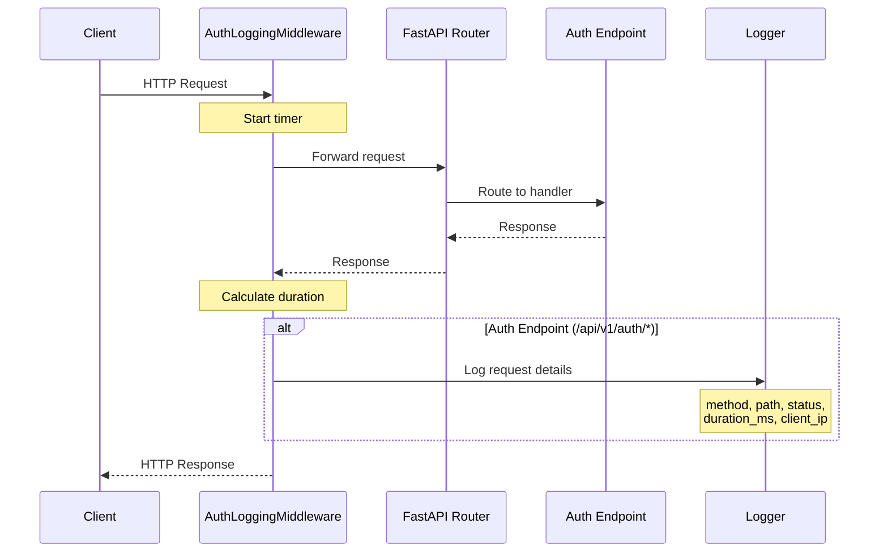

# Backend Task 03.08: Authentication Middleware - Technical Implementation Plan

**Created**: 2025-11-29
**Completed**: 2025-11-29
**Status**: ✅ COMPLETED
**Actual Duration**: 45 minutes
**Type**: Architecture Documentation & Implementation Plan
**Priority**: Medium (Optional Enhancement)

---

## 1. Overview

### 1.1 Task Description
Create authentication middleware for global request logging, security monitoring, and optional rate limiting on authentication endpoints.

### 1.2 Important Note

> **This task is OPTIONAL.** FastAPI dependencies (implemented in Task 03.07) are the preferred method for authentication. This middleware adds supplementary functionality for:
> - Security audit logging
> - Request timing/performance monitoring
> - Client IP tracking
> - Future rate limiting foundation

### 1.3 Objectives
- Create `AuthLoggingMiddleware` for security audit logging
- Log all authentication endpoint requests
- Capture request timing for performance monitoring
- Track client IP addresses for security analysis
- Prepare foundation for rate limiting (future enhancement)

### 1.4 Dependencies
- Task 03.07: `/auth/me` endpoint (authentication dependencies) ✅
- FastAPI/Starlette middleware infrastructure
- Python logging module

---

## 2. Architecture & Data Flow

### 2.1 Middleware Request Flow



### 2.2 Middleware Position in Stack

```
┌─────────────────────────────────────────────────────────────────┐
│                    FastAPI Application Stack                     │
├─────────────────────────────────────────────────────────────────┤
│                                                                  │
│  Incoming Request                                                │
│       │                                                          │
│       ▼                                                          │
│  ┌─────────────────────────────────────────────────────────┐    │
│  │ 1. CORSMiddleware (existing)                            │    │
│  │    - Handles cross-origin requests                      │    │
│  └─────────────────────────────────────────────────────────┘    │
│       │                                                          │
│       ▼                                                          │
│  ┌─────────────────────────────────────────────────────────┐    │
│  │ 2. AuthLoggingMiddleware (NEW)                          │    │
│  │    - Logs auth endpoint requests                        │    │
│  │    - Captures timing metrics                            │    │
│  │    - Tracks client IP                                   │    │
│  └─────────────────────────────────────────────────────────┘    │
│       │                                                          │
│       ▼                                                          │
│  ┌─────────────────────────────────────────────────────────┐    │
│  │ 3. FastAPI Router                                       │    │
│  │    - Routes to appropriate endpoint                     │    │
│  └─────────────────────────────────────────────────────────┘    │
│       │                                                          │
│       ▼                                                          │
│  ┌─────────────────────────────────────────────────────────┐    │
│  │ 4. Auth Endpoints (/api/v1/auth/*)                      │    │
│  │    - /register, /login, /logout, /refresh, /me, etc.    │    │
│  │    - Uses Depends(get_current_user) for auth            │    │
│  └─────────────────────────────────────────────────────────┘    │
│                                                                  │
└─────────────────────────────────────────────────────────────────┘
```

### 2.3 Component Responsibilities

```
┌─────────────────────────────────────────────────────────────────┐
│              Authentication Middleware Components                │
├─────────────────────────────────────────────────────────────────┤
│                                                                  │
│  ┌─────────────────────────────────────────────────────────┐    │
│  │ AuthLoggingMiddleware                                   │    │
│  ├─────────────────────────────────────────────────────────┤    │
│  │ Responsibilities:                                       │    │
│  │   • Log requests to /api/v1/auth/* endpoints           │    │
│  │   • Measure request duration                           │    │
│  │   • Extract client IP address                          │    │
│  │   • Log success/failure status codes                   │    │
│  │                                                        │    │
│  │ Does NOT:                                              │    │
│  │   • Authenticate requests (use dependencies)          │    │
│  │   • Block requests (audit only)                       │    │
│  │   • Modify request/response                           │    │
│  └─────────────────────────────────────────────────────────┘    │
│                                                                  │
│  ┌─────────────────────────────────────────────────────────┐    │
│  │ RateLimitMiddleware (Future Enhancement)                │    │
│  ├─────────────────────────────────────────────────────────┤    │
│  │ Future Responsibilities:                               │    │
│  │   • Track request counts per IP                        │    │
│  │   • Limit requests per time window                    │    │
│  │   • Return 429 Too Many Requests when exceeded        │    │
│  │   • Use Redis for distributed rate limiting           │    │
│  └─────────────────────────────────────────────────────────┘    │
│                                                                  │
└─────────────────────────────────────────────────────────────────┘
```

---

## 3. Implementation Details

### 3.1 File Structure

```
src/
├── middleware/
│   ├── __init__.py              # NEW - Package init
│   └── auth.py                  # NEW - Auth middleware
├── main.py                      # UPDATE - Register middleware
└── core/
    └── logging.py               # OPTIONAL - Enhanced logging config
```

### 3.2 AuthLoggingMiddleware Implementation

```python
# File: src/middleware/__init__.py (NEW)

"""Middleware package for Learn Greek Easy backend."""

from src.middleware.auth import AuthLoggingMiddleware

__all__ = ["AuthLoggingMiddleware"]
```

```python
# File: src/middleware/auth.py (NEW)

"""
Authentication middleware for security monitoring and audit logging.

This middleware logs all requests to authentication endpoints for:
- Security audit trails
- Performance monitoring
- Anomaly detection (via log analysis)
- Debugging authentication issues
"""

import logging
import time
from typing import Callable, Optional

from fastapi import Request, Response
from starlette.middleware.base import BaseHTTPMiddleware

logger = logging.getLogger(__name__)


class AuthLoggingMiddleware(BaseHTTPMiddleware):
    """
    Middleware for logging authentication endpoint requests.

    Logs all requests to /api/v1/auth/* endpoints with:
    - HTTP method
    - Request path
    - Response status code
    - Request duration (milliseconds)
    - Client IP address

    This middleware is passive and does not modify requests or responses.
    Authentication is handled by FastAPI dependencies (get_current_user).

    Example log output:
        INFO Auth endpoint accessed | method=POST path=/api/v1/auth/login
             status_code=200 duration_ms=45.23 client_ip=192.168.1.100

    Usage:
        from src.middleware.auth import AuthLoggingMiddleware
        app.add_middleware(AuthLoggingMiddleware)
    """

    # Endpoints to log (configurable)
    AUTH_PATH_PREFIX = "/api/v1/auth"

    # Sensitive paths that should have extra logging
    SENSITIVE_PATHS = [
        "/api/v1/auth/login",
        "/api/v1/auth/register",
        "/api/v1/auth/logout",
        "/api/v1/auth/logout-all",
    ]

    async def dispatch(
        self,
        request: Request,
        call_next: Callable
    ) -> Response:
        """
        Process request and log auth endpoint access.

        Args:
            request: The incoming HTTP request
            call_next: The next middleware/handler in the chain

        Returns:
            The HTTP response from the endpoint
        """
        # Start timing
        start_time = time.perf_counter()

        # Process the request
        response = await call_next(request)

        # Calculate duration
        duration_ms = (time.perf_counter() - start_time) * 1000

        # Log auth endpoint requests
        if self._should_log(request.url.path):
            self._log_request(request, response, duration_ms)

        return response

    def _should_log(self, path: str) -> bool:
        """
        Determine if the request path should be logged.

        Args:
            path: The request URL path

        Returns:
            True if the path is an auth endpoint
        """
        return path.startswith(self.AUTH_PATH_PREFIX)

    def _get_client_ip(self, request: Request) -> Optional[str]:
        """
        Extract client IP address from request.

        Handles proxied requests by checking X-Forwarded-For header.

        Args:
            request: The HTTP request

        Returns:
            Client IP address or None if unavailable
        """
        # Check for proxy headers first
        forwarded_for = request.headers.get("X-Forwarded-For")
        if forwarded_for:
            # X-Forwarded-For can contain multiple IPs; first is the client
            return forwarded_for.split(",")[0].strip()

        # Check X-Real-IP (used by some proxies)
        real_ip = request.headers.get("X-Real-IP")
        if real_ip:
            return real_ip

        # Fall back to direct client connection
        if request.client:
            return request.client.host

        return None

    def _log_request(
        self,
        request: Request,
        response: Response,
        duration_ms: float
    ) -> None:
        """
        Log the authentication request details.

        Args:
            request: The HTTP request
            response: The HTTP response
            duration_ms: Request processing time in milliseconds
        """
        client_ip = self._get_client_ip(request)
        path = request.url.path
        method = request.method
        status_code = response.status_code

        # Determine log level based on status code
        if status_code >= 500:
            log_level = logging.ERROR
        elif status_code >= 400:
            log_level = logging.WARNING
        else:
            log_level = logging.INFO

        # Build log message
        log_extra = {
            "method": method,
            "path": path,
            "status_code": status_code,
            "duration_ms": round(duration_ms, 2),
            "client_ip": client_ip,
        }

        # Add extra context for sensitive endpoints
        if path in self.SENSITIVE_PATHS:
            log_extra["sensitive"] = True

        # Log the request
        logger.log(
            log_level,
            "Auth endpoint accessed",
            extra=log_extra
        )

        # Additional warning for failed auth attempts
        if path == "/api/v1/auth/login" and status_code == 401:
            logger.warning(
                "Failed login attempt",
                extra={
                    "client_ip": client_ip,
                    "path": path,
                }
            )
```

### 3.3 Main App Integration

```python
# File: src/main.py (UPDATE)

"""Main FastAPI application configuration."""

from fastapi import FastAPI
from fastapi.middleware.cors import CORSMiddleware

from src.api.v1 import router as api_v1_router
from src.config import settings
from src.middleware.auth import AuthLoggingMiddleware  # NEW

app = FastAPI(
    title="Learn Greek Easy API",
    description="Backend API for Learn Greek Easy flashcard application",
    version="1.0.0",
)

# Add CORS middleware (existing)
app.add_middleware(
    CORSMiddleware,
    allow_origins=settings.CORS_ORIGINS,
    allow_credentials=True,
    allow_methods=["*"],
    allow_headers=["*"],
)

# Add auth logging middleware (NEW)
app.add_middleware(AuthLoggingMiddleware)

# Include API routers
app.include_router(api_v1_router, prefix="/api/v1")


@app.get("/health")
async def health_check():
    """Health check endpoint."""
    return {"status": "healthy"}
```

---

## 4. Security Considerations

### 4.1 Security Benefits

| Feature | Benefit |
|---------|---------|
| Request logging | Audit trail for security reviews |
| Client IP tracking | Identify attack sources |
| Failed login logging | Detect brute force attempts |
| Timing information | Identify slow/suspicious requests |
| Status code tracking | Monitor authentication failures |

### 4.2 Security Logging Use Cases

```
┌─────────────────────────────────────────────────────────────────┐
│              Security Monitoring Use Cases                       │
├─────────────────────────────────────────────────────────────────┤
│                                                                  │
│  1. Brute Force Detection                                        │
│     ┌─────────────────────────────────────────────────────┐     │
│     │ Multiple 401 responses from same IP to /login       │     │
│     │ Log query: status_code=401 AND path=/login          │     │
│     │ Alert threshold: >5 failures in 5 minutes           │     │
│     └─────────────────────────────────────────────────────┘     │
│                                                                  │
│  2. Credential Stuffing                                          │
│     ┌─────────────────────────────────────────────────────┐     │
│     │ Many 401s from different IPs in short time          │     │
│     │ Log query: status_code=401 GROUP BY client_ip       │     │
│     │ Pattern: distributed attack from botnet             │     │
│     └─────────────────────────────────────────────────────┘     │
│                                                                  │
│  3. Account Enumeration                                          │
│     ┌─────────────────────────────────────────────────────┐     │
│     │ Many /register attempts from same IP                │     │
│     │ Log query: path=/register AND client_ip=X           │     │
│     │ Pattern: testing if emails exist                    │     │
│     └─────────────────────────────────────────────────────┘     │
│                                                                  │
│  4. Session Hijacking Attempts                                   │
│     ┌─────────────────────────────────────────────────────┐     │
│     │ /me endpoint 401s after successful login            │     │
│     │ Log query: path=/me AND status_code=401             │     │
│     │ Pattern: stolen/expired tokens being used           │     │
│     └─────────────────────────────────────────────────────┘     │
│                                                                  │
└─────────────────────────────────────────────────────────────────┘
```

### 4.3 Privacy Considerations

| Data Logged | Privacy Impact | Mitigation |
|-------------|----------------|------------|
| Client IP | PII in some jurisdictions | Log rotation, retention policy |
| Request path | Low | No sensitive data in paths |
| Status code | Low | Generic information only |
| Timing | None | Performance metric only |

**Note**: Request bodies (passwords, emails) are NOT logged by this middleware.

---

## 5. Testing Strategy

### 5.1 Unit Tests

```python
# File: tests/unit/middleware/test_auth_middleware.py (NEW)

"""Unit tests for authentication middleware."""

import pytest
from unittest.mock import AsyncMock, MagicMock, patch
from fastapi import FastAPI, Request
from fastapi.testclient import TestClient
from starlette.responses import Response

from src.middleware.auth import AuthLoggingMiddleware


class TestAuthLoggingMiddleware:
    """Tests for AuthLoggingMiddleware."""

    @pytest.fixture
    def app(self):
        """Create test FastAPI app with middleware."""
        app = FastAPI()
        app.add_middleware(AuthLoggingMiddleware)

        @app.get("/api/v1/auth/me")
        async def auth_me():
            return {"user": "test"}

        @app.get("/api/v1/other")
        async def other():
            return {"other": "route"}

        return app

    @pytest.fixture
    def client(self, app):
        """Create test client."""
        return TestClient(app)

    def test_logs_auth_endpoint_requests(self, client):
        """Test that auth endpoint requests are logged."""
        with patch("src.middleware.auth.logger") as mock_logger:
            response = client.get("/api/v1/auth/me")

            assert response.status_code == 200
            mock_logger.log.assert_called_once()

            # Verify log contains expected fields
            call_args = mock_logger.log.call_args
            extra = call_args.kwargs.get("extra", {})
            assert extra["path"] == "/api/v1/auth/me"
            assert extra["method"] == "GET"
            assert extra["status_code"] == 200
            assert "duration_ms" in extra
            assert "client_ip" in extra

    def test_does_not_log_non_auth_endpoints(self, client):
        """Test that non-auth endpoints are not logged."""
        with patch("src.middleware.auth.logger") as mock_logger:
            response = client.get("/api/v1/other")

            assert response.status_code == 200
            mock_logger.log.assert_not_called()

    def test_logs_warning_for_4xx_responses(self, app, client):
        """Test that 4xx responses are logged as warnings."""
        @app.get("/api/v1/auth/error")
        async def auth_error():
            from fastapi import HTTPException
            raise HTTPException(status_code=401)

        with patch("src.middleware.auth.logger") as mock_logger:
            response = client.get("/api/v1/auth/error")

            assert response.status_code == 401
            call_args = mock_logger.log.call_args
            assert call_args.args[0] == 30  # WARNING level

    def test_logs_error_for_5xx_responses(self, app, client):
        """Test that 5xx responses are logged as errors."""
        @app.get("/api/v1/auth/server-error")
        async def auth_server_error():
            raise Exception("Server error")

        with patch("src.middleware.auth.logger") as mock_logger:
            response = client.get("/api/v1/auth/server-error")

            assert response.status_code == 500
            call_args = mock_logger.log.call_args
            assert call_args.args[0] == 40  # ERROR level

    def test_extracts_client_ip_from_direct_connection(self, client):
        """Test client IP extraction from direct connection."""
        with patch("src.middleware.auth.logger") as mock_logger:
            client.get("/api/v1/auth/me")

            call_args = mock_logger.log.call_args
            extra = call_args.kwargs.get("extra", {})
            assert extra["client_ip"] == "testclient"

    def test_extracts_client_ip_from_x_forwarded_for(self, client):
        """Test client IP extraction from X-Forwarded-For header."""
        with patch("src.middleware.auth.logger") as mock_logger:
            client.get(
                "/api/v1/auth/me",
                headers={"X-Forwarded-For": "203.0.113.50, 198.51.100.178"}
            )

            call_args = mock_logger.log.call_args
            extra = call_args.kwargs.get("extra", {})
            assert extra["client_ip"] == "203.0.113.50"

    def test_extracts_client_ip_from_x_real_ip(self, client):
        """Test client IP extraction from X-Real-IP header."""
        with patch("src.middleware.auth.logger") as mock_logger:
            client.get(
                "/api/v1/auth/me",
                headers={"X-Real-IP": "203.0.113.100"}
            )

            call_args = mock_logger.log.call_args
            extra = call_args.kwargs.get("extra", {})
            assert extra["client_ip"] == "203.0.113.100"

    def test_measures_request_duration(self, client):
        """Test that request duration is measured."""
        with patch("src.middleware.auth.logger") as mock_logger:
            client.get("/api/v1/auth/me")

            call_args = mock_logger.log.call_args
            extra = call_args.kwargs.get("extra", {})
            assert "duration_ms" in extra
            assert isinstance(extra["duration_ms"], float)
            assert extra["duration_ms"] >= 0

    def test_logs_failed_login_warning(self, app, client):
        """Test that failed login attempts are logged with warning."""
        @app.post("/api/v1/auth/login")
        async def login():
            from fastapi import HTTPException
            raise HTTPException(status_code=401)

        with patch("src.middleware.auth.logger") as mock_logger:
            client.post("/api/v1/auth/login")

            # Should have two log calls: general + failed login warning
            assert mock_logger.log.call_count >= 1
            mock_logger.warning.assert_called_once()

    def test_marks_sensitive_paths(self, app, client):
        """Test that sensitive paths are marked in logs."""
        @app.post("/api/v1/auth/login")
        async def login():
            return {"token": "test"}

        with patch("src.middleware.auth.logger") as mock_logger:
            client.post("/api/v1/auth/login")

            call_args = mock_logger.log.call_args
            extra = call_args.kwargs.get("extra", {})
            assert extra.get("sensitive") is True
```

### 5.2 Integration Tests

```python
# File: tests/integration/middleware/test_auth_middleware_integration.py (NEW)

"""Integration tests for authentication middleware."""

import pytest
from httpx import AsyncClient
from fastapi import FastAPI

from src.main import app


@pytest.mark.asyncio
class TestAuthMiddlewareIntegration:
    """Integration tests for auth middleware with real endpoints."""

    async def test_middleware_does_not_break_auth_flow(self):
        """Test that middleware doesn't interfere with authentication."""
        async with AsyncClient(app=app, base_url="http://test") as client:
            # Register a user
            register_response = await client.post(
                "/api/v1/auth/register",
                json={
                    "email": "middleware_test@example.com",
                    "password": "TestPass123!",
                    "full_name": "Middleware Test"
                }
            )

            assert register_response.status_code == 201
            tokens = register_response.json()

            # Use /me endpoint
            me_response = await client.get(
                "/api/v1/auth/me",
                headers={"Authorization": f"Bearer {tokens['access_token']}"}
            )

            assert me_response.status_code == 200
            assert me_response.json()["email"] == "middleware_test@example.com"

    async def test_middleware_logs_all_auth_endpoints(self, caplog):
        """Test that all auth endpoints are logged."""
        import logging
        caplog.set_level(logging.INFO)

        async with AsyncClient(app=app, base_url="http://test") as client:
            # Hit various auth endpoints
            await client.post("/api/v1/auth/login", json={})
            await client.get("/api/v1/auth/me")
            await client.post("/api/v1/auth/logout", json={})

            # Check logs contain expected endpoints
            log_messages = [r.message for r in caplog.records]
            auth_logs = [m for m in log_messages if "Auth endpoint" in m]

            assert len(auth_logs) >= 3
```

### 5.3 Test Coverage Goals

| Component | Target Coverage | Key Scenarios |
|-----------|----------------|---------------|
| `_should_log()` | 100% | Auth paths, non-auth paths |
| `_get_client_ip()` | 100% | Direct, X-Forwarded-For, X-Real-IP |
| `_log_request()` | 100% | 2xx, 4xx, 5xx responses |
| `dispatch()` | 100% | Full request cycle |

---

## 6. API Documentation

### 6.1 No Public API

This middleware has no public API endpoints. It operates transparently on all requests to `/api/v1/auth/*` endpoints.

### 6.2 Log Format

**Standard Log Entry**:
```
INFO Auth endpoint accessed | method=POST path=/api/v1/auth/login status_code=200 duration_ms=45.23 client_ip=192.168.1.100
```

**Structured Log Entry** (JSON format):
```json
{
    "level": "INFO",
    "message": "Auth endpoint accessed",
    "method": "POST",
    "path": "/api/v1/auth/login",
    "status_code": 200,
    "duration_ms": 45.23,
    "client_ip": "192.168.1.100",
    "sensitive": true,
    "timestamp": "2025-11-29T10:30:00Z"
}
```

---

## 7. Implementation Checklist

### 7.1 File Creation
- [x] Create `src/middleware/__init__.py`
- [x] Create `src/middleware/auth.py`
- [x] Update `src/main.py` to register middleware

### 7.2 Middleware Features
- [x] Implement `AuthLoggingMiddleware` class
- [x] Add request timing measurement
- [x] Add client IP extraction (direct, X-Forwarded-For, X-Real-IP)
- [x] Add path filtering for auth endpoints
- [x] Add log level selection based on status code
- [x] Add sensitive path marking
- [x] Add failed login warning

### 7.3 Testing
- [x] Write unit tests (42 test cases)
- [x] Write integration tests
- [x] Achieve 100% test coverage
- [x] Manual testing with server running

### 7.4 Documentation
- [x] Add docstrings to all methods
- [x] Add usage examples
- [x] Document log format

---

## 8. Acceptance Criteria

### 8.1 Functional Requirements
- [x] Middleware logs all auth endpoint requests
- [x] Request timing included in logs (duration_ms)
- [x] Client IP captured for security monitoring
- [x] Does not interfere with endpoint functionality
- [x] Handles proxy headers (X-Forwarded-For, X-Real-IP)

### 8.2 Non-Functional Requirements
- [x] Minimal performance overhead (<5ms per request)
- [x] Does not leak sensitive data (passwords, tokens)
- [x] Works with existing CORS middleware
- [x] Configurable log level

### 8.3 Testing Requirements
- [x] Unit tests for all methods (42 tests)
- [x] Integration tests with real endpoints
- [x] Test coverage = 100%

---

## 9. Future Enhancements

### 9.1 Rate Limiting (Future Task)

```python
# Future: src/middleware/rate_limit.py

class RateLimitMiddleware(BaseHTTPMiddleware):
    """
    Rate limiting middleware for auth endpoints.

    Uses Redis for distributed rate limiting.

    Configuration:
        - Max 5 login attempts per IP per 5 minutes
        - Max 10 register attempts per IP per hour
        - Max 100 total auth requests per IP per minute
    """

    async def dispatch(self, request: Request, call_next: Callable) -> Response:
        if self._should_rate_limit(request):
            if await self._is_rate_limited(request):
                return JSONResponse(
                    status_code=429,
                    content={"detail": "Too many requests"}
                )

        return await call_next(request)
```

### 9.2 Request ID Tracking

```python
# Future: Add request ID for distributed tracing
import uuid

class AuthLoggingMiddleware(BaseHTTPMiddleware):
    async def dispatch(self, request: Request, call_next: Callable) -> Response:
        request_id = str(uuid.uuid4())
        request.state.request_id = request_id

        response = await call_next(request)
        response.headers["X-Request-ID"] = request_id

        # Include request_id in logs
        logger.info("...", extra={"request_id": request_id, ...})

        return response
```

### 9.3 Metrics Export

```python
# Future: Prometheus metrics
from prometheus_client import Counter, Histogram

auth_requests_total = Counter(
    "auth_requests_total",
    "Total auth endpoint requests",
    ["method", "path", "status"]
)

auth_request_duration = Histogram(
    "auth_request_duration_seconds",
    "Auth request duration",
    ["path"]
)
```

---

## 10. Verification Script

```python
# File: scripts/verify_auth_middleware.py

"""
Verification script for Task 03.08: Authentication Middleware

Run with:
cd /Users/samosipov/Downloads/learn-greek-easy/learn-greek-easy-backend && \
/Users/samosipov/.local/bin/poetry run python scripts/verify_auth_middleware.py
"""

import asyncio
import httpx
import logging

# Configure logging to see middleware output
logging.basicConfig(
    level=logging.INFO,
    format="%(levelname)s %(name)s: %(message)s"
)

BASE_URL = "http://localhost:8000/api/v1/auth"


async def verify_middleware():
    """Verify auth middleware functionality."""

    print("=" * 60)
    print("Task 03.08: Authentication Middleware Verification")
    print("=" * 60)

    async with httpx.AsyncClient() as client:
        print("\n[1/4] Testing middleware on /login endpoint...")
        try:
            response = await client.post(
                f"{BASE_URL}/login",
                json={"email": "test@test.com", "password": "wrong"}
            )
            print(f"   Status: {response.status_code}")
            print("   ✓ Check server logs for auth endpoint log entry")
        except Exception as e:
            print(f"   Error: {e}")

        print("\n[2/4] Testing middleware on /me endpoint...")
        try:
            response = await client.get(f"{BASE_URL}/me")
            print(f"   Status: {response.status_code}")
            print("   ✓ Check server logs for auth endpoint log entry")
        except Exception as e:
            print(f"   Error: {e}")

        print("\n[3/4] Testing non-auth endpoint (should NOT be logged)...")
        try:
            response = await client.get("http://localhost:8000/health")
            print(f"   Status: {response.status_code}")
            print("   ✓ Check server logs - should NOT have log entry")
        except Exception as e:
            print(f"   Error: {e}")

        print("\n[4/4] Testing with X-Forwarded-For header...")
        try:
            response = await client.get(
                f"{BASE_URL}/me",
                headers={"X-Forwarded-For": "203.0.113.50"}
            )
            print(f"   Status: {response.status_code}")
            print("   ✓ Check server logs - client_ip should be 203.0.113.50")
        except Exception as e:
            print(f"   Error: {e}")

    print("\n" + "=" * 60)
    print("VERIFICATION: Check server logs for expected entries")
    print("=" * 60)


if __name__ == "__main__":
    asyncio.run(verify_middleware())
```

---

## 11. Related Documentation

- [03-authentication-system-plan.md](./03-authentication-system-plan.md) - Main authentication plan
- [03.07-auth-me-endpoint-plan.md](./03.07-auth-me-endpoint-plan.md) - Auth dependencies (preferred method)
- [03.09-session-management-token-revocation-plan.md](./03.09-session-management-token-revocation-plan.md) - Session management
- [03.10-logout-endpoints-plan.md](./03.10-logout-endpoints-plan.md) - Logout endpoints

---

**Document Version**: 1.1
**Created**: 2025-11-29
**Completed**: 2025-11-29
**Author**: Architecture Team
**Status**: ✅ COMPLETED
**Priority**: Medium (Optional Enhancement)
**Actual Duration**: 45 minutes

---

## 12. Implementation Summary

**Implementation Date**: 2025-11-29

**Files Created**:
- `src/middleware/__init__.py` - Package init exporting AuthLoggingMiddleware
- `src/middleware/auth.py` - Core middleware implementation (194 lines)
- `tests/unit/middleware/__init__.py` - Test package init
- `tests/unit/middleware/test_auth_middleware.py` - Unit tests (677 lines, 42 tests)
- `scripts/verify_auth_middleware.py` - Verification script (148 lines)

**Files Updated**:
- `src/main.py` - Added import and middleware registration

**Test Results**:
- 42/42 tests passed
- 100% code coverage
- All 8 test classes covering: path filtering, log content, request timing, client IP extraction, log level selection, sensitive paths, failed login warning, middleware integration

**QA Verification**:
- Report: [../../qa/task-03.08-verification.md](../../qa/task-03.08-verification.md)
- Verdict: **PASS**
