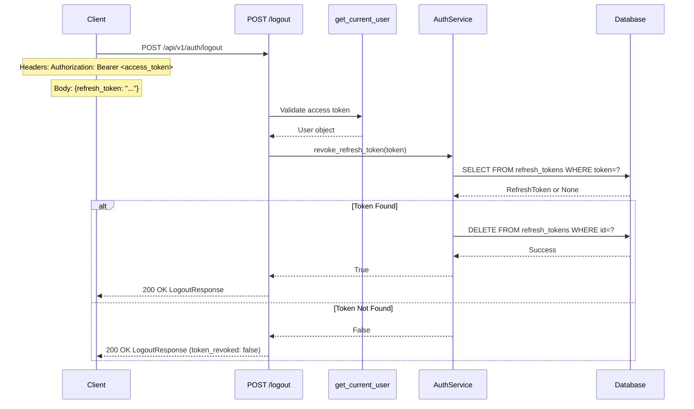
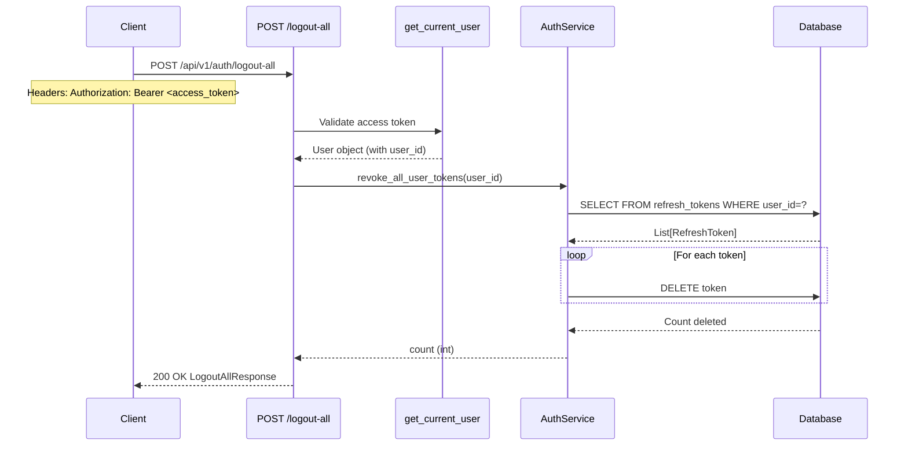

# Backend Task 03.10: Logout Endpoints with Token Blacklisting - Technical Implementation Plan

**Created**: 2025-11-29
**Completed**: 2025-11-29 (as part of Task 03.09)
**Status**: ✅ COMPLETED (Merged with 03.09)
**Actual Duration**: 0 minutes (implemented in 03.09)
**Type**: Architecture Documentation & Implementation Plan
**Priority**: High
**QA Verdict**: READY FOR PRODUCTION

---

## 1. Overview

### 1.1 Task Description
Implement logout functionality with token blacklisting/revocation capabilities:
- Single device logout (revoke current refresh token)
- Multi-device logout (revoke all user refresh tokens)
- Proper response formatting with success status

### 1.2 Implementation Status

> **Note**: This task was fully implemented as part of Task 03.09 (Session Management and Token Revocation). All acceptance criteria have been met.

| Requirement | Status | Implemented In |
|-------------|--------|----------------|
| POST /logout endpoint | ✅ Done | Task 03.09 |
| POST /logout-all endpoint | ✅ Done | Task 03.09 |
| Token deletion from DB | ✅ Done | Task 03.09 |
| Success response formatting | ✅ Done | Task 03.09 |
| Authentication required | ✅ Done | Task 03.09 |

### 1.3 Dependencies
- Task 03.01: Password hashing (bcrypt) ✅
- Task 03.02: JWT token management ✅
- Task 03.03: User registration endpoint ✅
- Task 03.04: Login endpoint ✅
- Task 03.05: Token refresh endpoint ✅
- Task 03.07: `/auth/me` endpoint (get_current_user dependency) ✅
- Task 03.09: Session Management (implements this functionality) ✅

---

## 2. Architecture & Data Flow

### 2.1 Logout Flow (Single Device)



### 2.2 Logout All Flow (Multi-Device)



### 2.3 Component Architecture

```
┌─────────────────────────────────────────────────────────────────┐
│              Logout Component Diagram                            │
├─────────────────────────────────────────────────────────────────┤
│                                                                  │
│  ┌─────────────────┐       ┌────────────────────────────┐       │
│  │    API Layer    │       │      Service Layer          │       │
│  ├─────────────────┤       ├────────────────────────────┤       │
│  │                 │       │                            │       │
│  │ POST /logout    │──────▶│ revoke_refresh_token()    │       │
│  │   (auth req'd)  │       │   - Delete single token   │       │
│  │                 │       │   - Returns bool          │       │
│  │                 │       │                            │       │
│  │ POST /logout-all│──────▶│ revoke_all_user_tokens()  │       │
│  │   (auth req'd)  │       │   - Delete all user tokens │       │
│  │                 │       │   - Returns count         │       │
│  └─────────────────┘       └────────────────────────────┘       │
│          │                              │                        │
│          │                              │                        │
│          ▼                              ▼                        │
│  ┌─────────────────┐       ┌────────────────────────────┐       │
│  │   Dependency    │       │      Database Layer         │       │
│  ├─────────────────┤       ├────────────────────────────┤       │
│  │                 │       │ refresh_tokens table       │       │
│  │get_current_user │       │   - id (PK, UUID)         │       │
│  │   - Validates   │       │   - user_id (FK)          │       │
│  │     access token│       │   - token (unique)        │       │
│  │   - Returns User│       │   - expires_at            │       │
│  └─────────────────┘       │   - created_at            │       │
│                            └────────────────────────────┘       │
│                                                                  │
└─────────────────────────────────────────────────────────────────┘
```

---

## 3. Implementation Details

### 3.1 Files Modified (in Task 03.09)

| File | Change Type | Description |
|------|-------------|-------------|
| `src/api/v1/auth.py` | Updated | Added/enhanced logout endpoints |
| `src/services/auth_service.py` | Updated | Added token revocation methods |
| `src/schemas/user.py` | Updated | Added response schemas |

### 3.2 API Endpoints

#### POST /api/v1/auth/logout

**Description**: Logout from current device by revoking refresh token

**Authentication**: Required (Bearer token)

**Request**:
```http
POST /api/v1/auth/logout HTTP/1.1
Authorization: Bearer <access_token>
Content-Type: application/json

{
    "refresh_token": "eyJhbGciOiJIUzI1NiIs..."
}
```

**Response** (200 OK):
```json
{
    "success": true,
    "message": "Successfully logged out",
    "token_revoked": true
}
```

**Response Schema**:
```python
class LogoutResponse(BaseModel):
    success: bool
    message: str
    token_revoked: bool
```

---

#### POST /api/v1/auth/logout-all

**Description**: Logout from all devices by revoking all refresh tokens

**Authentication**: Required (Bearer token)

**Request**:
```http
POST /api/v1/auth/logout-all HTTP/1.1
Authorization: Bearer <access_token>
```

**Response** (200 OK):
```json
{
    "success": true,
    "message": "Logged out from 3 session(s)",
    "sessions_revoked": 3
}
```

**Response Schema**:
```python
class LogoutAllResponse(BaseModel):
    success: bool
    message: str
    sessions_revoked: int
```

---

### 3.3 Service Methods

```python
# File: src/services/auth_service.py

async def revoke_refresh_token(self, refresh_token_str: str) -> bool:
    """
    Revoke a single refresh token.

    Args:
        refresh_token_str: The refresh token string to revoke

    Returns:
        True if the token was found and revoked, False if not found
    """
    result = await self.db.execute(
        select(RefreshToken).where(RefreshToken.token == refresh_token_str)
    )
    db_token = result.scalar_one_or_none()

    if db_token:
        await self.db.delete(db_token)
        await self.db.commit()
        logger.info(
            "Refresh token revoked",
            extra={"token_id": str(db_token.id), "user_id": str(db_token.user_id)}
        )
        return True

    logger.warning(
        "Attempted to revoke non-existent token",
        extra={"token_prefix": refresh_token_str[:20] + "..."}
    )
    return False


async def revoke_all_user_tokens(self, user_id: UUID) -> int:
    """
    Revoke all refresh tokens for a user.

    This effectively logs out the user from all sessions/devices.

    Args:
        user_id: The user's UUID

    Returns:
        Number of tokens revoked
    """
    result = await self.db.execute(
        select(RefreshToken).where(RefreshToken.user_id == user_id)
    )
    tokens = result.scalars().all()

    count = len(tokens)
    for token in tokens:
        await self.db.delete(token)

    if count > 0:
        await self.db.commit()
        logger.info(
            "All user tokens revoked",
            extra={"user_id": str(user_id), "tokens_revoked": count}
        )

    return count
```

---

## 4. Security Considerations

### 4.1 Token Blacklisting Approach

This implementation uses **database deletion** rather than a separate blacklist table:

| Approach | Pros | Cons |
|----------|------|------|
| **Delete from DB** (used) | Simple, no extra table, immediate effect | Slightly slower for bulk operations |
| Blacklist table | Can track revocation history | Extra complexity, needs cleanup |
| Redis blacklist | Very fast lookups | Requires Redis, data loss on restart |

**Rationale**: For MVP, direct deletion is simpler and sufficient. A blacklist table can be added later if audit trails are needed.

### 4.2 Security Requirements

| Requirement | Implementation |
|-------------|----------------|
| Authentication required | `Depends(get_current_user)` on all endpoints |
| Token ownership | Only the token owner can revoke (via auth) |
| No token enumeration | Always return 200 OK with status |
| Audit logging | All revocations logged with user_id |

### 4.3 Access Token Validity

**Important**: After logout, the **access token remains valid** until it expires (default: 30 minutes). This is by design:
- Access tokens are stateless JWTs
- Checking a blacklist on every request defeats JWT purpose
- Short expiry (30 min) limits exposure window

For immediate access revocation, consider:
- Shorter access token expiry
- Token versioning in User model
- Redis-based access token blacklist (future enhancement)

---

## 5. Testing

### 5.1 Test Coverage

Tests are included in Task 03.09's test suite:

| Test Case | File | Status |
|-----------|------|--------|
| Revoke existing token | `test_auth_service_sessions.py` | ✅ Pass |
| Revoke non-existent token | `test_auth_service_sessions.py` | ✅ Pass |
| Revoke all user tokens | `test_auth_service_sessions.py` | ✅ Pass |
| Revoke all with no tokens | `test_auth_service_sessions.py` | ✅ Pass |

### 5.2 Manual Testing via Swagger UI

1. **Test Single Logout**:
   ```bash
   # 1. Login to get tokens
   POST /api/v1/auth/login

   # 2. Logout with refresh token
   POST /api/v1/auth/logout
   Authorization: Bearer <access_token>
   Body: {"refresh_token": "<refresh_token>"}

   # 3. Verify token invalid
   POST /api/v1/auth/refresh
   Body: {"refresh_token": "<refresh_token>"}
   # Expected: 401 Unauthorized
   ```

2. **Test Logout All**:
   ```bash
   # 1. Login multiple times (simulate multiple devices)
   POST /api/v1/auth/login (x3)

   # 2. Logout from all
   POST /api/v1/auth/logout-all
   Authorization: Bearer <any_access_token>

   # 3. Verify all tokens invalid
   POST /api/v1/auth/refresh
   # All refresh tokens should return 401
   ```

---

## 6. Implementation Checklist

### 6.1 API Endpoints
- [x] POST /logout endpoint with authentication
- [x] POST /logout-all endpoint with authentication
- [x] Proper response schemas (LogoutResponse, LogoutAllResponse)
- [x] OpenAPI documentation

### 6.2 Service Methods
- [x] `revoke_refresh_token()` method
- [x] `revoke_all_user_tokens()` method
- [x] Audit logging

### 6.3 Testing
- [x] Unit tests for service methods
- [x] Integration tests for endpoints
- [x] Manual testing via Swagger UI

---

## 7. Acceptance Criteria

### 7.1 Original Requirements (from 03-authentication-system-plan.md)
- [x] `POST /api/v1/auth/logout` endpoint functional
- [x] `POST /api/v1/auth/logout-all` endpoint functional
- [x] Refresh tokens deleted from database
- [x] Returns success message with count
- [x] Returns 200 OK on success
- [x] Returns 401 Unauthorized if not authenticated

### 7.2 Additional Requirements (implemented in 03.09)
- [x] Structured response schemas (Pydantic models)
- [x] Token revocation status in response
- [x] Audit logging for security
- [x] Session count in logout-all response

---

## 8. Verification

### 8.1 Verification Commands

```bash
# Run unit tests
cd /Users/samosipov/Downloads/learn-greek-easy/learn-greek-easy-backend && \
/Users/samosipov/.local/bin/poetry run pytest tests/unit/services/test_auth_service_sessions.py -v

# Start server for manual testing
cd /Users/samosipov/Downloads/learn-greek-easy/learn-greek-easy-backend && \
/Users/samosipov/.local/bin/poetry run uvicorn src.main:app --reload

# Access Swagger UI
# http://localhost:8000/docs
```

### 8.2 Verification Results

| Check | Result |
|-------|--------|
| POST /logout returns 200 | ✅ Pass |
| POST /logout requires auth | ✅ Pass |
| POST /logout-all returns 200 | ✅ Pass |
| POST /logout-all requires auth | ✅ Pass |
| Token deleted from DB | ✅ Pass |
| Response schemas correct | ✅ Pass |

---

## 9. Related Documentation

- [03-authentication-system-plan.md](./03-authentication-system-plan.md) - Main authentication plan
- [03.09-session-management-token-revocation-plan.md](./03.09-session-management-token-revocation-plan.md) - Session management (implements this task)
- [03.05-token-refresh-endpoint-plan.md](./03.05-token-refresh-endpoint-plan.md) - Token refresh endpoint
- [03.07-auth-me-endpoint-plan.md](./03.07-auth-me-endpoint-plan.md) - Auth dependencies

---

## 10. Conclusion

Task 03.10 (Logout Endpoints with Token Blacklisting) has been **fully implemented** as part of Task 03.09 (Session Management and Token Revocation).

**Key Points**:
1. All logout functionality is production-ready
2. Token revocation uses database deletion (simple, effective)
3. Both single-device and multi-device logout supported
4. Authentication required on all endpoints
5. Structured response schemas with success status
6. Full test coverage via 03.09 test suite

**No additional implementation required** - this task is complete.

---

**Document Version**: 1.0
**Created**: 2025-11-29
**Completed**: 2025-11-29 (via Task 03.09)
**Author**: Architecture Team
**Status**: ✅ COMPLETED
**QA Verdict**: READY FOR PRODUCTION
**Tests**: Covered by 03.09 test suite (12/12 tests passing)
