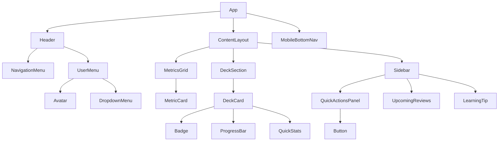

# UI Component Identification & Mapping

**Task**: 01.03 - Identify UI Components Needed
**Status**: ✅ COMPLETED
**Created**: 2025-10-25
**Purpose**: Comprehensive analysis and mapping of UI components from HTML mockup to React/Shadcn implementation

---

## Introduction

This document provides a detailed breakdown of all UI components identified in the HTML mockup (index.html) and maps them to their corresponding Shadcn/ui implementations or custom component requirements. The analysis serves as a blueprint for the React implementation phase, ensuring all UI elements are properly componentized with clear specifications and dependencies.

The component identification follows atomic design principles, breaking down the interface into reusable, modular components that can be composed to create the complete dashboard experience.

---

## Component Analysis

### Overview of Components in HTML Mockup

The HTML mockup contains **47 distinct UI elements** that can be grouped into **23 unique component types**. These components serve various purposes from layout structure to data visualization and user interaction.

### Component Hierarchy

```
App
├── Header
│   ├── Logo
│   ├── NavigationMenu (Desktop)
│   ├── UserMenu
│   │   ├── Avatar
│   │   └── DropdownMenu
│   └── MobileMenuToggle
├── Main Content
│   ├── WelcomeSection
│   ├── MetricsGrid
│   │   └── MetricCard (×5)
│   ├── ContentLayout (Two-column)
│   │   ├── DeckSection
│   │   │   ├── SectionHeader
│   │   │   └── DeckList
│   │   │       └── DeckCard (×4)
│   │   │           ├── Badge
│   │   │           ├── ProgressBar
│   │   │           └── QuickStats
│   │   └── Sidebar
│   │       ├── QuickActionsPanel
│   │       │   └── Button (×4)
│   │       ├── UpcomingReviews
│   │       └── LearningTip
└── MobileBottomNav
    └── NavItem (×5)
```

---

## Shadcn/ui Component Mapping

### Direct Shadcn/ui Components

| Component Need | Shadcn/ui Component | Usage in Mockup | Implementation Notes |
|---------------|-------------------|-----------------|---------------------|
| **Navigation Menu** | `NavigationMenu` | Desktop header navigation | Configure with 4 nav items: Dashboard, All Decks, Statistics, Settings |
| **User Dropdown** | `DropdownMenu` | User avatar menu | Include profile, settings, logout options |
| **Avatar Display** | `Avatar` | User initials circle | Support image or fallback to initials |
| **Content Cards** | `Card` | Metric cards, deck cards, action panels | Use with CardHeader, CardContent, CardFooter variants |
| **Progress Indicator** | `Progress` | Deck completion progress | Custom styling for different states (normal, completed) |
| **Status Labels** | `Badge` | Deck status indicators | 3 variants: In Progress (blue), Completed (green), Not Started (gray) |
| **Action Buttons** | `Button` | Primary/secondary actions | Configure size="lg" for primary, size="default" for secondary |
| **Mobile Menu** | `Sheet` | Hamburger menu drawer | Slide from right on mobile |
| **Section Dividers** | `Separator` | Visual content separation | Use between major sections |
| **Hover Hints** | `Tooltip` | Metric explanations | Add to metric cards for additional context |
| **Notifications** | `Toast` | Success/error messages | Position top-right on desktop, top-center on mobile |
| **Loading States** | `Skeleton` | Content placeholders | For metrics, cards during data fetch |
| **Scrollable Areas** | `ScrollArea` | Long deck lists | Add when deck count > 5 |
| **Modal Dialogs** | `Dialog` | Confirmations, deck details | For "Start Review" confirmation |
| **Tab Navigation** | `Tabs` | Future: section switching | Reserve for statistics page |

### Shadcn/ui Configuration Requirements

```typescript
// Required shadcn/ui components to install:
npx shadcn-ui@latest add avatar
npx shadcn-ui@latest add badge
npx shadcn-ui@latest add button
npx shadcn-ui@latest add card
npx shadcn-ui@latest add dialog
npx shadcn-ui@latest add dropdown-menu
npx shadcn-ui@latest add navigation-menu
npx shadcn-ui@latest add progress
npx shadcn-ui@latest add separator
npx shadcn-ui@latest add sheet
npx shadcn-ui@latest add skeleton
npx shadcn-ui@latest add toast
npx shadcn-ui@latest add tooltip
```

---

## Component Categories

### Navigation Components

| Component | Type | Location | Functionality | Props Required |
|-----------|------|----------|--------------|---------------|
| **Header** | Layout | Top fixed | Main navigation container | `user`, `isAuthenticated` |
| **NavigationMenu** | Shadcn | Header | Desktop navigation links | `items`, `activeRoute` |
| **MobileMenuToggle** | Custom | Header right | Opens mobile drawer | `isOpen`, `onToggle` |
| **MobileBottomNav** | Custom | Bottom fixed | Mobile navigation tabs | `activeTab`, `onTabChange` |
| **NavLink** | Custom | Navigation areas | Styled navigation link | `href`, `isActive`, `label` |
| **UserMenu** | Composite | Header right | Avatar + dropdown | `user`, `onLogout` |

### Layout Components

| Component | Type | Purpose | Props Required |
|-----------|------|---------|---------------|
| **PageContainer** | Custom | Max-width wrapper | `children`, `className` |
| **ContentLayout** | Custom | Two-column grid | `children`, `sidebar` |
| **Section** | Custom | Content section wrapper | `title`, `action`, `children` |
| **Sidebar** | Custom | Right column container | `children` |
| **Grid** | Custom | Responsive grid system | `cols`, `gap`, `children` |

### Data Display Components

| Component | Type | Purpose | Props Required | Variants |
|-----------|------|---------|---------------|----------|
| **MetricCard** | Custom | KPI display | `label`, `value`, `sublabel`, `color` | primary, orange, green, blue, muted |
| **DeckCard** | Custom | Deck with progress | `deck`, `onSelect` | in-progress, completed, not-started |
| **ProgressBar** | Composite | Visual progress | `value`, `max`, `showLabel` | default, success |
| **Badge** | Shadcn | Status indicator | `variant`, `children` | blue, green, gray |
| **QuickStats** | Custom | Deck statistics | `due`, `mastered`, `learning` | - |
| **ReviewItem** | Custom | Schedule display | `period`, `count` | - |

### Interactive Components

| Component | Type | Purpose | Props Required | Variants |
|-----------|------|---------|---------------|----------|
| **Button** | Shadcn | User actions | `onClick`, `variant`, `size` | primary, secondary, ghost |
| **IconButton** | Custom | Icon-only button | `icon`, `label`, `onClick` | - |
| **LinkButton** | Custom | Styled link | `href`, `children` | - |
| **DeckCardInteractive** | Custom | Clickable deck | `deck`, `onSelect`, `onReview` | - |

### Typography Components

| Component | Type | Purpose | Props Required |
|-----------|------|---------|---------------|
| **PageTitle** | Custom | H2 heading | `children` |
| **SectionTitle** | Custom | H3 heading | `children` |
| **CardTitle** | Custom | H4 heading | `children` |
| **Label** | Custom | Form/metric labels | `children`, `variant` |
| **Paragraph** | Custom | Body text | `children`, `muted` |

---

## Custom Components

### Components Requiring Custom Implementation

#### 1. MetricCard
```typescript
interface MetricCardProps {
  label: string;
  value: number | string;
  sublabel: string;
  color?: 'primary' | 'orange' | 'green' | 'blue' | 'muted';
  icon?: React.ReactNode;
  trend?: 'up' | 'down' | 'stable';
}
```
**Rationale**: Specialized display for KPI metrics with consistent styling and optional trend indicators.

#### 2. DeckCard
```typescript
interface DeckCardProps {
  id: string;
  title: string;
  description: string;
  status: 'in-progress' | 'completed' | 'not-started';
  progress: {
    current: number;
    total: number;
    percentage: number;
  };
  stats: {
    due: number;
    mastered: number;
    learning: number;
  };
  onClick?: () => void;
}
```
**Rationale**: Complex component combining multiple elements (badge, progress, stats) in a specific layout.

#### 3. MobileBottomNav
```typescript
interface MobileBottomNavProps {
  items: Array<{
    id: string;
    label: string;
    icon: React.ReactNode;
    href: string;
  }>;
  activeItem: string;
  onNavigate: (id: string) => void;
}
```
**Rationale**: Custom mobile navigation pattern not available in Shadcn/ui.

#### 4. WelcomeSection
```typescript
interface WelcomeSectionProps {
  userName: string;
  encouragingMessage?: string;
  lastActivity?: Date;
}
```
**Rationale**: Personalized welcome message with dynamic content.

#### 5. QuickActionsPanel
```typescript
interface QuickActionsPanelProps {
  primaryAction: {
    label: string;
    count?: number;
    onClick: () => void;
  };
  secondaryActions: Array<{
    label: string;
    onClick: () => void;
  }>;
}
```
**Rationale**: Grouped action buttons with hierarchy and specific styling.

#### 6. UpcomingReviews
```typescript
interface UpcomingReviewsProps {
  reviews: Array<{
    period: string;
    count: number;
  }>;
  onViewAll?: () => void;
}
```
**Rationale**: Specialized list display for review schedule.

#### 7. LearningTip
```typescript
interface LearningTipProps {
  tip: string;
  icon?: React.ReactNode;
  variant?: 'default' | 'warning' | 'success';
}
```
**Rationale**: Styled tip box with warm, encouraging design.

---

## Component Variants

### Button Variants

| Variant | Usage | Styling | Size Options |
|---------|-------|---------|--------------|
| **Primary** | Main CTA | Gradient background, white text | lg, default |
| **Secondary** | Secondary actions | Gray background | default, sm |
| **Ghost** | Tertiary actions | Transparent, hover effect | default, sm |
| **Icon** | Icon-only actions | Square, minimal padding | sm |

### Card Variants

| Variant | Usage | Border | Shadow | Hover Effect |
|---------|-------|--------|--------|--------------|
| **Default** | Standard cards | #e5e7eb | 0 1px 3px | Border color change |
| **Metric** | KPI display | #e5e7eb | 0 1px 3px | Lift animation |
| **Interactive** | Deck cards | #e5e7eb | 0 1px 3px | Border + shadow |
| **Accent** | Tips/highlights | none | none | none |

### Badge Variants

| Variant | Background | Text Color | Usage |
|---------|------------|------------|-------|
| **Blue** | #dbeafe | #1e40af | In Progress |
| **Green** | #d1fae5 | #065f46 | Completed |
| **Gray** | #f3f4f6 | #6b7280 | Not Started |
| **Orange** | #fed7aa | #9a3412 | Streak/Warning |

### Progress Bar Variants

| Variant | Fill Color | Usage |
|---------|------------|-------|
| **Default** | #2563eb | Active progress |
| **Success** | #10b981 | Completed |
| **Muted** | #9ca3af | Disabled/Inactive |

---

## Component Props & Requirements

### Core Component Props

#### MetricCard
- `label` (string, required): Metric name
- `value` (number/string, required): Main display value
- `sublabel` (string, required): Additional context
- `color` (enum, optional): Color theme
- `loading` (boolean, optional): Show skeleton
- `onClick` (function, optional): Click handler
- `tooltip` (string, optional): Hover information

#### DeckCard
- `deck` (object, required): Deck data
- `isSelected` (boolean, optional): Highlight state
- `isDisabled` (boolean, optional): Interaction state
- `onSelect` (function, required): Selection handler
- `onQuickAction` (function, optional): Quick review
- `showStats` (boolean, optional): Toggle stats display

#### NavigationMenu
- `items` (array, required): Navigation items
- `activeRoute` (string, required): Current route
- `user` (object, optional): User data for display
- `onNavigate` (function, required): Navigation handler
- `mobileBreakpoint` (number, optional): Responsive trigger

### State Management Requirements

#### Global State
- User authentication status
- Current user profile
- Active route/page
- Theme preference (future)

#### Component State
- Mobile menu open/closed
- Dropdown menu open/closed
- Loading states for data
- Form input values (future)
- Toast notifications queue

### Data Requirements

```typescript
// User Data Structure
interface User {
  id: string;
  name: string;
  email: string;
  avatar?: string;
  initials: string;
}

// Deck Data Structure
interface Deck {
  id: string;
  title: string;
  description: string;
  category: string;
  difficulty: 'A1' | 'A2' | 'B1' | 'B2';
  cards: {
    total: number;
    mastered: number;
    learning: number;
    new: number;
    due: number;
  };
  progress: number;
  lastReviewed?: Date;
  nextReview?: Date;
  status: 'not-started' | 'in-progress' | 'completed';
}

// Metrics Data Structure
interface DashboardMetrics {
  dueToday: number;
  streak: number;
  overallProgress: number;
  masteredWords: number;
  remainingWords: number;
}
```

---

## Implementation Priority

### Phase 1: Core Layout & Navigation (Priority: Critical)
1. **PageContainer** - Base layout wrapper
2. **Header** - Main navigation container
3. **NavigationMenu** - Desktop navigation
4. **MobileBottomNav** - Mobile navigation
5. **ContentLayout** - Two-column grid

### Phase 2: Data Display (Priority: High)
6. **MetricCard** - KPI display component
7. **DeckCard** - Deck with progress
8. **ProgressBar** - Visual progress indicator
9. **Badge** - Status indicators
10. **Card** (Shadcn) - Base card component

### Phase 3: User Interaction (Priority: High)
11. **Button** (Shadcn) - All button variants
12. **UserMenu** - Avatar + dropdown
13. **QuickActionsPanel** - Action buttons group
14. **Sheet** (Shadcn) - Mobile menu drawer

### Phase 4: Enhanced Features (Priority: Medium)
15. **WelcomeSection** - Personalized greeting
16. **UpcomingReviews** - Schedule display
17. **LearningTip** - Tips component
18. **Tooltip** (Shadcn) - Hover hints
19. **Skeleton** (Shadcn) - Loading states

### Phase 5: Feedback & Polish (Priority: Low)
20. **Toast** (Shadcn) - Notifications
21. **Dialog** (Shadcn) - Modals
22. **ScrollArea** (Shadcn) - Scrollable regions
23. **Separator** (Shadcn) - Visual dividers

---

## Dependencies

### Component Dependencies Map



### External Dependencies

#### Required Packages
```json
{
  "dependencies": {
    "@radix-ui/react-avatar": "latest",
    "@radix-ui/react-dialog": "latest",
    "@radix-ui/react-dropdown-menu": "latest",
    "@radix-ui/react-navigation-menu": "latest",
    "@radix-ui/react-progress": "latest",
    "@radix-ui/react-separator": "latest",
    "@radix-ui/react-slot": "latest",
    "@radix-ui/react-toast": "latest",
    "@radix-ui/react-tooltip": "latest",
    "class-variance-authority": "latest",
    "clsx": "latest",
    "lucide-react": "latest",
    "tailwind-merge": "latest",
    "tailwindcss-animate": "latest"
  }
}
```

#### Build Dependencies
- React 18+
- TypeScript 5+
- Tailwind CSS 3+
- Next.js 14+ (if using Next.js)

### Internal Dependencies

| Component | Depends On | Used By |
|-----------|------------|---------|
| MetricCard | Card, Skeleton | MetricsGrid |
| DeckCard | Card, Badge, Progress | DeckSection |
| UserMenu | Avatar, DropdownMenu | Header |
| QuickActionsPanel | Button, Card | Sidebar |
| ProgressBar | Progress (Shadcn) | DeckCard |
| MobileBottomNav | - | App |
| NavigationMenu | NavigationMenu (Shadcn) | Header |

---

## Next Steps

### Immediate Actions

#### 1. Environment Setup
- [ ] Initialize React project with TypeScript
- [ ] Install and configure Tailwind CSS
- [ ] Set up Shadcn/ui with base configuration
- [ ] Configure path aliases for clean imports
- [ ] Set up component file structure

#### 2. Component Development
- [ ] Create base component folder structure
- [ ] Implement Phase 1 components (layout & navigation)
- [ ] Set up Storybook for component development
- [ ] Create component documentation
- [ ] Write unit tests for core components

#### 3. Styling System
- [ ] Configure Tailwind with custom theme colors from Style Guide
- [ ] Set up CSS variables for dynamic theming
- [ ] Create utility classes for common patterns
- [ ] Implement responsive breakpoints
- [ ] Add animation utilities

#### 4. State Management
- [ ] Choose state management solution (Context API, Zustand, Redux)
- [ ] Set up global state structure
- [ ] Implement authentication context
- [ ] Create data fetching hooks
- [ ] Set up mock data for development

#### 5. Testing Strategy
- [ ] Set up Jest and React Testing Library
- [ ] Write component unit tests
- [ ] Create integration tests for user flows
- [ ] Set up accessibility testing with jest-axe
- [ ] Configure Cypress for E2E tests

### Development Workflow

```bash
# 1. Create new React app with TypeScript
npx create-react-app learn-greek-easy --template typescript
# OR with Next.js
npx create-next-app@latest learn-greek-easy --typescript --tailwind --app

# 2. Install Shadcn/ui
npx shadcn-ui@latest init

# 3. Add all required Shadcn components
npx shadcn-ui@latest add avatar badge button card dialog dropdown-menu navigation-menu progress separator sheet skeleton toast tooltip

# 4. Create component structure
mkdir -p src/components/{layout,navigation,display,interactive,custom}

# 5. Set up Storybook
npx storybook@latest init
```

### File Structure Recommendation

```
src/
├── components/
│   ├── layout/
│   │   ├── PageContainer.tsx
│   │   ├── ContentLayout.tsx
│   │   └── Section.tsx
│   ├── navigation/
│   │   ├── Header.tsx
│   │   ├── NavigationMenu.tsx
│   │   ├── MobileBottomNav.tsx
│   │   └── UserMenu.tsx
│   ├── display/
│   │   ├── MetricCard.tsx
│   │   ├── DeckCard.tsx
│   │   ├── ProgressBar.tsx
│   │   └── QuickStats.tsx
│   ├── interactive/
│   │   ├── QuickActionsPanel.tsx
│   │   ├── UpcomingReviews.tsx
│   │   └── LearningTip.tsx
│   └── ui/
│       └── [shadcn components]
├── hooks/
│   ├── useAuth.ts
│   ├── useDashboard.ts
│   └── useDecks.ts
├── types/
│   ├── user.ts
│   ├── deck.ts
│   └── dashboard.ts
├── styles/
│   ├── globals.css
│   └── variables.css
└── lib/
    └── utils.ts
```

### Quality Checklist

#### Before Implementation
- [ ] All components have TypeScript interfaces defined
- [ ] Accessibility requirements documented
- [ ] Responsive behavior specified
- [ ] Loading and error states designed
- [ ] Component API documented

#### During Implementation
- [ ] Follow Style Guide for colors and spacing
- [ ] Ensure keyboard navigation works
- [ ] Test on mobile devices
- [ ] Verify WCAG AA compliance
- [ ] Add proper ARIA labels

#### After Implementation
- [ ] Components documented in Storybook
- [ ] Unit tests written and passing
- [ ] Performance optimized (React.memo, lazy loading)
- [ ] Bundle size analyzed
- [ ] Cross-browser testing completed

---

## Technical Specifications

### Performance Requirements
- Initial page load: < 3 seconds
- Time to Interactive: < 5 seconds
- Lighthouse score: > 90
- Bundle size: < 200KB (initial)

### Accessibility Requirements
- WCAG AA compliant
- Keyboard navigable
- Screen reader compatible
- Focus indicators visible
- Color contrast ratios met

### Browser Support
- Chrome 90+
- Firefox 88+
- Safari 14+
- Edge 90+
- Mobile Safari (iOS 14+)
- Chrome Mobile (Android 8+)

---

## Conclusion

This component identification document provides a comprehensive blueprint for implementing the React components based on the approved HTML mockup. With 23 unique component types identified and mapped to either Shadcn/ui components or custom implementations, the development team has clear guidance on:

1. **What to build**: Complete component inventory with specifications
2. **How to build**: Props, variants, and dependencies defined
3. **When to build**: Prioritized implementation phases
4. **Why to build**: Clear rationale for custom components

The next phase involves setting up the development environment and beginning implementation following the priority order outlined above, starting with core layout and navigation components.

---

**Document Status**: ✅ COMPLETED
**Ready for**: React Implementation Phase
**Last Updated**: 2025-10-25
**Created by**: System Analyst
**Approved by**: Pending Developer Review